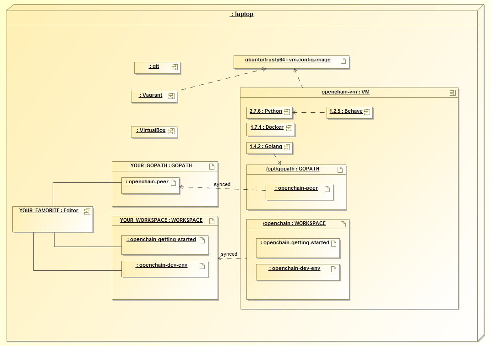

## openchain-dev-env

If you're looking for instructions on how to setup the Openchain development environment, see
the [obc-docs project](https://github.com/openblockchain/obc-docs/blob/master/dev-setup/devenv.md).

This is the openchain development environment project which is used for bootstrapping the openchain development environment.

Below is a deployment diagram of the current develpment environment. Note that version numbers may be out of date.


# Storage Backends

You may optionally choose a docker storage backend other than the default.

For a comparison of the assorted storage backends refer to [select a storage driver](https://docs.docker.com/engine/userguide/storagedriver/selectadriver/)

Presently, the default is set to AUFS, but this may change in the future.

To select a different storage backend (btrfs in this example), simply execute

```
vagrant destroy
DOCKER_STORAGE_BACKEND=btrfs vagrant up
```

Currently supported backends are btfs, and aufs, with more to be added in the future.
