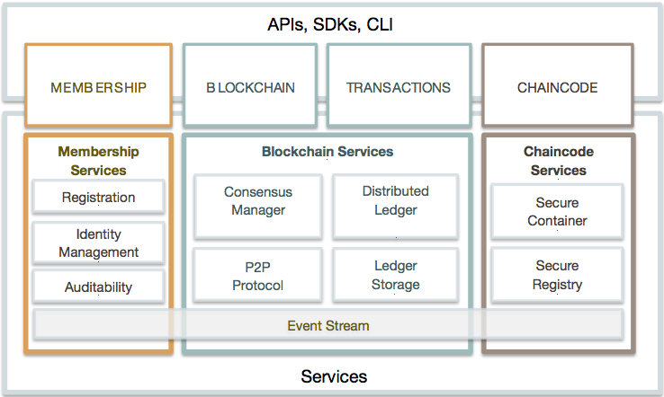
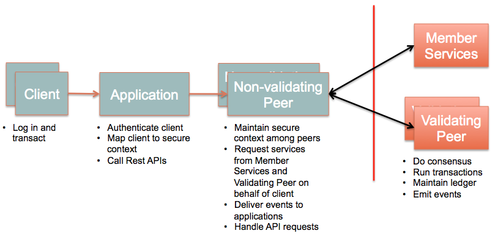
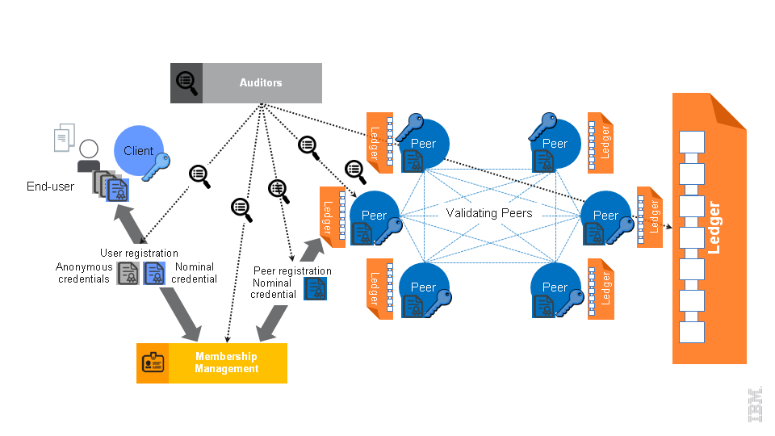
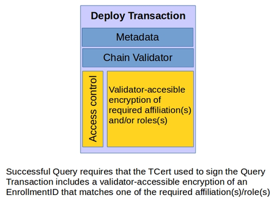
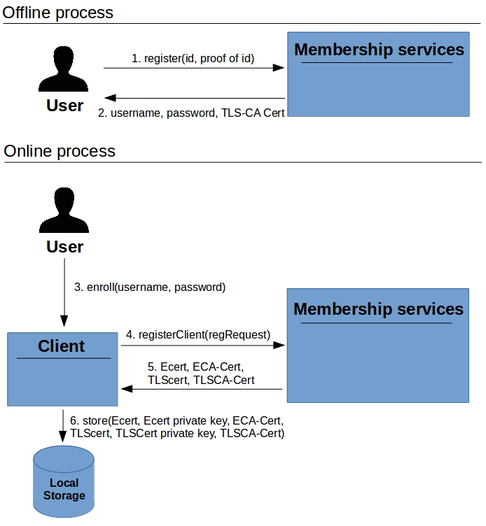
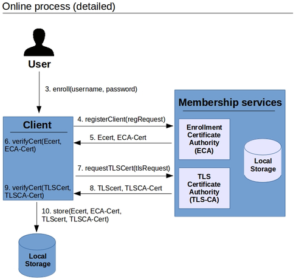
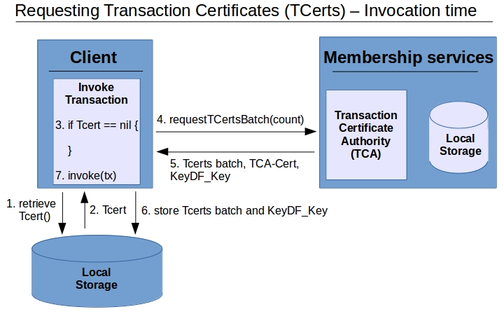

## Getting started

Welcome to the Linux Foundation Hyperledger Project documentation README. This page contains: 
- Getting started doc links 
- Quickstart doc links
- Table of Contents links to the complete library

If you are new to the project, you can begin by reviewing the following documents:
- [Whitepaper WG](https://github.com/hyperledger/hyperledger/wiki/Whitepaper-WG)
- [Requirements WG](https://github.com/hyperledger/hyperledger/wiki/Requirements-WG)
- [Glossary](glossary.md): to understand the terminology that we use throughout the website and project.

When you are ready to start building applications or to otherwise contribute to the project, we strongly recommend that you read our [protocol specification](protocol-spec.md) for the technical details. Procedurally, we use the agile methodology with a weekly sprint, organized by [issues](https://github.com/hyperledger/fabric/issues), so take a look to familiarize yourself with the current work.

## Project documentation:

- [Project Lifecycle](https://github.com/hyperledger/hyperledger/wiki/Project-Lifecycle)
- [Contributing](../CONTRIBUTING.md)
- [Communicating](../README.md#communication-)
- [Maintainers](../MAINTAINERS.txt)
- [License](../LICENSE)

## Quickstart documentation
In addition to the <b>Getting started</b> documentation, the following quickstart topics are available:
- [Fabric FAQs](FAQ)
- [Canonical use cases](biz/usecases.md)
- [Development environment set-up](dev-setup/devenv.md)
- [Chaincode development environment](API/SandboxSetup.md)
- [APIs](API/CoreAPI.md)
- [Network setup](dev-setup/devnet-setup.md)

### Diagrams index
- 
- 
- 
- 
- 
- 
- 
- 
- 
- 
- 

## Table of Contents

The table of contents provides links to the complete documentation library:

### Overview docs:

- [Hyperledger project](https://github.com/hyperledger/hyperledger)
- [Whitepaper](https://github.com/hyperledger/hyperledger/wiki/Whitepaper-WG)
- [Fabric README](../README.md)
- [Glossary](glossary.md) 
- [Figures & Diagrams](/docs/images/) 
- [Protocol specification](protocol-spec.md):
     - [Introduction](protocol-spec.md#Introduction-)
     - [Fabric](protocol-spec.md#2.-Fabric-) 
          - [Architecture](protocol-spec.md#2.1-Architecture-) (Membership Services, Blockchain Services, Chaincode Services, Events, API, CLI)
          - [Topology](protocol-spec.md#2.2-Topology-) (SVP, MVP, Multichain)
     - [Protocol](protocol-spec.md#3.-Protocol-) (Messages, Ledger, Chaincode, Consensus, Events)
          - [Messages](protocol-spec.md#3.1-Message-) (Discovery, Transaction, Synchronization, Consensus)
	  - [Ledger](protocol-spec.md#3.2-Ledger-) (Blockchain, World State)
	  - [Chaincode](protocol-spec.md#3.3-Chaincode-) (VMI, Chaincode Protocol)
	  - [Consensus](protocol-spec.md#3.4-Pluggable-Consensus-Framework-) (Interfaces: Consenter, CPI, Inquirer, Communicator, SecurityUtils, LedgerStack, Executor, Ledger, RemoteLedgers; Packages: controller, helper)
          - [Events](protocol-spec.md#3.5-Events-) (Stream, Adapters, Structure)
     - [Security](protocol-spec.md#4.-Security-)
          - [Business Security](protocol-spec.md#4.1-Business-security-requirements-)
	  - [User Privacy](protocol-spec.md#4.2-User-Privacy-through-Membership-Services-) (ECerts, TCerts)
	       - [User/Client Enrollment Process](protocol-spec.md#4.2.1-User/Client-Enrollment-Process-)
	       - [Expiration and revocation of certificates](protocol-spec.md#4.2.2-Expiration-and-revocation-of-certificates-)
	  - [Transaction security offerings at the infrastructure level](protocol-spec.md#4.3-Transaction-security-offerings-at-the-infrastructure-level-) 
	       - [Security Lifecycle of Transactions](protocol-spec.md#4.3.1-Security-Lifecycle-of-Transactions-)
	       - [Transaction confidentiality](protocol-spec.md#4.3.2-Transaction-confidentiality-) (Confidentiality against users) (Confidentiality against validators)
	       - [Replay attack resistance](protocol-spec.md#4.3.3-Replay-attack-resistance-)
	  - [Access control features on the application](protocol-spec.md#4.4-Access-control-features-on-the-application-) 
	       - [Invocation access control](protocol-spec.md#4.4.1-Invocation-access-control-)
	       - [Read access control](protocol-spec.md#4.4.2-Read-access-control-)
	  - [Online wallet service](protocol-spec.md#4.5-Online-wallet-service-)
	  - [Network security (TLS)](protocol-spec.md#4.6-Network-security-(TLS)-)
	  - [Restrictions in the current release](protocol-spec.md#4.7-Restrictions-in-the-current-release-)
	       - [Simplified client](protocol-spec.md#4.7.1-Simplified-client-)
	       - [Simplified transaction confidentiality](protocol-spec.md#4.7.2-Simplified-transaction-confidentiality-)
     - [Byzantine Consensus](protocol-spec.md#5.-Byzantine-Consensus-)
          - [Overview](protocol-spec.md#5.1-Overview-)
	  - [Core PBFT Functions](protocol-spec.md#5.2-Core-PBFT-Functions-)
	       - [newPbftCore](protocol-spec.md#5.2.1-newPbftCore-)
	       - [request](protocol-spec.md#5.2.2-request-)
	       - [receive](protocol-spec.md#5.2.3-receive-)
	       - [close](protocol-spec.md#5.2.4-close-)
	  - [Inner Consensus Programming Interface](protocol-spec.md#5.3-Inner-Consensus-Programming-Interface-)
	       - [broadcast](protocol-spec.md#5.3.1-broadcast-)
	       - [unicast](protocol-spec.md#5.3.2-unicast-)
	       - [validate](protocol-spec.md#5.3.3-validate-)
	       - [execute](protocol-spec.md#5.3.4-execute-)
	       - [viewChange](protocol-spec.md#5.3.5-viewChange-)
	  - [Sieve Consensus protocol](protocol-spec.md#5.4-Sieve-Consensus-protocol-)
     - [Application Programming Interface]((protocol-spec.md#6.-Application-Programming-Interface-)
          - [REST Service](protocol-spec.md#6.1-REST-Service-)
	  - [REST API](protocol-spec.md#6.2-REST-API-)
	       - [REST endpoints](protocol-spec.md#6.2.1-REST-endpoints-) (Block API, Blockchain API, Chaincode API, Network API, Registrar API, Transactions API)
	  - [CLI](protocol-spec.md#6.3-CLI-)
	       - [CLI Commands](protocol-spec.md#6.3.1-CLI-Commands-) (peer, login, chaincode deploy, chaincode invoke, chaincode query)
     - [Application Model]((protocol-spec.md#7.-Application-Model)
          - [Composition of an Application](protocol-spec.md#7.1-Composition-of-an-Application-)
     - [References]((protocol-spec.md#9.-References)

### API and chaincode developer docs:

- [Setting up the development environment](dev-setup/devenv.md): 
     - Overview (Vagrant/Docker) 
     - Prerequisites (Git, Go, Vagrant, VirtualBox, BIOS)
     - Steps (GOPATH, Windows, Clone Peer, VM Vagrant
- [Building the fabric core](dev-setup/install.md#building-the-fabric-core-)
- [Building outside of Vagrant](dev-setup/install.md#building-outside-of-vagrant-)
- [Code contributions](../CONTRIBUTING.md)
- [Coding Golang](dev-setup/install.md#coding-golang-)
- [Headers](dev-setup/headers.txt)
- [Writing Chaincode](dev-setup/install.md#writing-chaincode-)
- [Writing, Building, and Running Chaincode in a Development Environment](API/SandboxSetup.md)
- [Chaincode FAQ](FAQ/chaincode_FAQ.md)
- [Setting Up a Network](dev-setup/install.md#setting-up-a-network-)
- [Setting Up a Network For Development](dev-setup/devnet-setup.md):
     - Docker
     - Validating Peers
     - Run chaincode
     - Consensus Plugin
- [Working with CLI, REST, and Node.js](dev-setup/install.md#working-with-cli-rest-and-nodejs-)
- [APIs - CLI, REST, and Node.js](API/CoreAPI.md): 
     - [CLI](API/CoreAPI.md#cli)
     - [REST](API/CoreAPI.md#rest-api)
     - [Node.js Application](API/CoreAPI.md#nodejs-application)
- [Configuration](dev-setup/install.md#configuration-)
- [Logging](dev-setup/install.md#logging-)
- [Logging control](dev-setup/logging-control.md): 
     - Overview 
     - Peer
     - Go 
- [Generating grpc code](dev-setup/install.md#generating-grpc-code-)
- [Adding or updating Go packages](dev-setup/install.md#adding-or-updating-go-packages-)
- [SDK](wiki-images)

### Network operations docs:

- [Setting Up a Network](dev-setup/install.md#setting-up-a-network-)
- [Consensus Algorithms](FAQ/consensus_FAQ.md)

### Security administration docs:

- [Certificate Authority (CA) Setup](dev-setup/obcca-setup.md):
     - Enrollment CA
     - Transaction CA
     - TLS CA
     - Configuration
     - Build and Run   
- [Application ACL](tech/application-ACL.md):
     - Fabric Support
     - Certificate Handler
     - Transaction Handler
     - Client
     - Transaction Format
     - Validators
     - Deploy Transaction
     - Execute Transaction
     - Chaincode Execution
