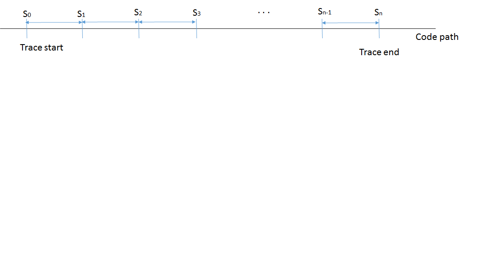
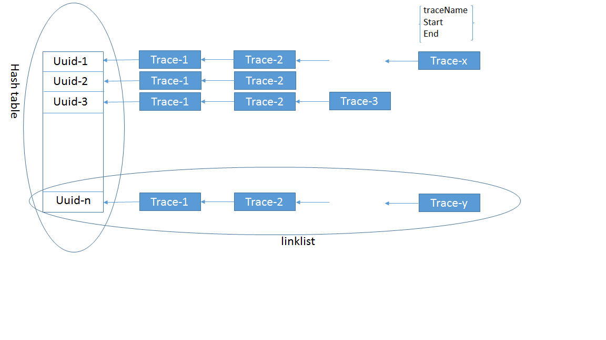

##Performance Instrumentation

The purpose of performance trace instrumentation is to measure the performance of IBM hyperledger fabric.  The trace instrumentation is written in golang.  The instrumentation provides the time used by all segments specified by the user in the code path.  Thus, the results of the instrumentation can be used to identify the segments in the code path that need to be optimized to improve the performance.
 

##Instrumentation Concepts

The instrumentation requires a sequence of tracepoints in the order of time in the code path, with the first one as the starting point and the last one as the ending point. When the transactions are issued, one transaction at a time, the instrumentation can calculate and report the latency in milliseconds for each segment between two tracepoints.  Tracing is only for one transaction at a time. The diagram below demonstrates the segments of a code path.

The instrumentation creates a hash table with an uuid as the entry index for each transaction. And a link list associated to each hash table entry is created.  Each entry of the link list contains the user provided trace name and starting and ending timestamps of a segment.  Note that the instrumentation can only measure one transaction at a time.  It will not start to measure the next transaction if the measurement of previous one has not completed.  The diagram below shows the completion of n transactions are measured.

##Using Instrumentation

PerfTraceHandler() is the instrumentation handler with the following input arguments:

    uuid: string
          hash table id
    name: string
          trace name of this link list entry
    now:  int64
          timestamp
    res:  bool
          result of the corresponding segment execution
    action: string
          type of actions:
            1. Create - create hash table entry and start a new link list with the first entry having the name provided
            2. CreatePTOP - close current link list entry and create a new link list entry with the name provided
            3. EndPTOP - close current link list entry and end current link list
            4. CreatePTOPFrom - Close current link list entry, create a link list entry with the name and timestamps (now) provided, and start a new one from time.Now() with the same trace name as the newly created entry with preface "Since_"

With the hyperledger from github, users need to

1. enable instrumentation
2. set tracepoints
3. execute transactions
4. instrumentation output
 
###Enable Instrumentation

There are two ways to enable/disable the instrumentation: static and dynamic.  The default of instrumentation is disabled.

1. Static: The instrumentation can be enabled or disabled by setting the environment variable perfutil.enabled to true or false in core.yaml file.
         
        ###############################################################################
        #
        #    Performance Trace section
        #
        ###############################################################################
        perfutil:

            # Enable/disable setting for the performance trace service. It is recommended to disable
            # performance trace service in production deployment
            enabled: true

2. Dynamic: The instrumentation can also be enabled/disabled using an REST API with /perfutil as the endpoint. In the example below, 127.0.0.1 is the target IP address and 5000 is the REST interface port. The instrumentation can be enabled or disabled by setting the ctorMsg function to "enable" or "disable".

        curl 127.0.0.1:5000/perfutil
        {
            "chaincodeSpec": {
                "ctorMsg": {
                   "function": "enable"
                }
            }
        }  
The output of this REST API is as follow:

        performance trace enabled

3. The state of instrumentation can be obtained by the following REST API.

        curl 127.0.0.1:5000/perfutil
        {
            "chaincodeSpec": {
                "ctorMsg": {
                   "function": "state"
                }
            }
        }  
The output of this REST API is as follow:

        performance trace global state: true

###Set Tracepoints

1. import "github.com/hyperledger/fabric/core/perfutil" in the goland file

        import  "github.com/hyperledger/fabric/core/perfutil"

2. set the starting point, the first tracepoint, using perfTraceHandler() with action "Create" and user provided uuid and trace name:

        perfutil.PerfTraceHandler(uuid, "TraceName", 0, true, "Create")

3. set the ending point, the last tracepoint, using perfTraceHandler() with action "ENDTPOP":

        perfutil.PerfTraceHandler(uuid, "", 0, true, "EndPTOP")

4. set tracepoints between the starting and ending points using perfTraceHandler() with action "CreateTPOP" and user provided uuid and trace name:

        perfutil.PerfTraceHandler(uuid, "TraceName", 0, true, "CreatePTOP")

#####Uuid

A unique uuid is required to create an entry in the hash table and a link list entry. The hyperledger fabric generates an uuid for each transactions which can be used for the hash table entry. The uuid of the link list entries must be the same as the one used to create the hash table entry.

When the hash entry is created, the associated uuid is stored in the cache.  The user can choose to use the cached uuid or provide the same uuid when creating a new link list entry.  The API GetPerfUuid() returns the cached uuid. This is useful in the case when the uuid is not available. The following golang code demonstrates the usage of the cached uuid to create a new link list entry:

       perfutil.PerfTraceHandler(perfutil.GetPerfUuid(), "TraceName", 0, true, "CreatePTOP")

The uuid associated with current trace can be obtained by the following REST API.

        curl 127.0.0.1:5000/perfutil
        {
            "chaincodeSpec": {
                "ctorMsg": {
                   "function": "getUuid"
                }
            }
        }  
The output of this REST API is as follow:

        performance trace transaction uuid: 3f954381-ada6-44f0-b9c4-a23360bf5cba

#####Tracepoints

The hyperledger fabric from github contains many built-in tracepoints. Users can add/remove/move any tracepoints between starting and ending tracepoints or change the starting and ending points as needed.  When changing the starting and ending points, be sure that the starting point is the first one and the ending point is the last one in the sequence of tracepoints.

The starting and ending points of the built-in tracepoints are as follow:

1. Deploy: 
The starting point is at the Deploy() in devops.go

        // Now create the Transactions message and send to Peer.
	    transID := chaincodeDeploymentSpec.ChaincodeSpec.ChaincodeID.Name
	    perfutil.PerfTraceHandler(transID, "devops.Deploy", 0, true, "Create")
and the ending point is at HandleMessage() in chaincode handler.go

        chaincodeLogger.Debug("[%s]Handling ChaincodeMessage of type: %s in state %s", shortuuid(msg.Uuid), msg.Type, handler.FSM.Current())

        if msg.Type == pb.ChaincodeMessage_COMPLETED {
        perfutil.PerfTraceHandler(perfutil.GetPerfUuid(), "", 0, true, "EndPTOP")
        }

2. Invoke:
The starting point is at the invokeOrQuery() in devops.go

	    // Now create the Transactions message and send to Peer.
	    uuid := util.GenerateUUID()
	    perfutil.PerfTraceHandler(uuid, "devops.invokeOrQuery", 0, true, "Create")
and the ending point is at HandleMessage() in chaincode handler.go 

        chaincodeLogger.Debug("[%s]Handling ChaincodeMessage of type: %s in state %s", shortuuid(msg.Uuid), msg.Type, handler.FSM.Current())

        if msg.Type == pb.ChaincodeMessage_COMPLETED {
        perfutil.PerfTraceHandler(perfutil.GetPerfUuid(), "", 0, true, "EndPTOP")
        }

3. Query:
The starting point is at the invokeOrQuery() in devops.go

	    // Now create the Transactions message and send to Peer.
	    uuid := util.GenerateUUID()
	    perfutil.PerfTraceHandler(uuid, "devops.invokeOrQuery", 0, true, "Create")
and the ending point is at the invokeOrQuery() in devops.go 

        if resp.Status == pb.Response_FAILURE {
                err = fmt.Errorf(string(resp.Msg))
        } else {
                if !invoke && nil != sec && viper.GetBool("security.privacy") {
                        if resp.Msg, err = sec.DecryptQueryResult(transaction, resp.Msg); nil != err {
                                devopsLogger.Debug("Failed decrypting query transaction result %s", string(resp.Msg[:]))
                                //resp = &pb.Response{Status: pb.Response_FAILURE, Msg: []byte(err.Error())}
                        }
                }
                if !invoke {
                        perfutil.PerfTraceHandler(perfutil.GetPerfUuid(), "", 0, true, "EndPTOP")
                }
        }
        return resp, err

###Execute transactions

After enabling the instrumentation and setting up the tracepoints, the use can execute transactions, one at a time.  Currently, no concurrent execution is allowed.  There is no limit on the number of transactions to be executed.

###Instrumentation Output

The user can use a REST API with /perfutil as the endpoint and the content of the REST API is shown below to see the performance result on the window executing the peer command. In this example, 127.0.0.1 is the target IP address and 5000 is the REST interface port. It is recommended to set the log level to error to have a cleaner output.

        curl 127.0.0.1:5000/perfutil
        {
            "chaincodeSpec": {
                "ctorMsg": {
                   "function": "dump"
                }
            }
        }  

The following is an example of the instrumentation output from a query transaction with security and privacy enabled:

    Stats for tx 3f954381-ada6-44f0-b9c4-a23360bf5cba
        devops.invokeOrQuery 0.009720 ms
        client.InitClient 0.009699 ms
        client_impl.init 11.167362 ms
        client_crypto.initTCertEngine 0.072722 ms
        client_tca.initTCertEngine 0.416500 ms
        client_tcert_pool_st.Start 0.044522 ms
        client_ks.loadUnusedTCerts-Query 0.189282 ms
        client_ks.loadUnusedTCerts-sql.ErrNoRows 0.009439 ms
        client_ks.loadUnusedTCerts-scan 2.022622 ms
        client_ks.loadUnusedTCerts-delete 78.726492 ms
        devops.createExecTx 0.000018 ms
        peer.ExecuteTransaction 0.000003 ms
        peer.sendTransactionsToLocalEngine 0.000006 ms
        engine.ProcessTransactionMsg 0.000003 ms
        exectransaction.Execute 0.250498 ms
        handler.sendExecuteMessage 0.016356 ms
        serialSend 0.624555 ms
        GetState_GRPC 0.316150 ms
        Since_GetState_GRPC 0.350405 ms
        GET_STATE_FSM 0.033566 ms
        Since_GET_STATE_FSM 0.077741 ms
        GetLedger 0.040203 ms
        GetLedger_done 0.009595 ms
        serialSend 1.128450 ms
        QueryCompleted_GRPC 0.228311 ms
        Since_QueryCompleted_GRPC 0.232749 ms
        handler.HandleMessage 0.677804 ms

        total 96.654773 ms

Once the measured result is printed, the instrumentation cache is cleared.  The user can start another instrumentation measurement by issuing new transactions. 

Notes:

1. The time unit is in ms.

2. The entries ending with "\_GRPC" and without prefix "Since" such as GetState_GRPC, is the transmission time from chaincode to peer thru gRPC. The entry is created using action "ENDTPOP".

        GetState_GRPC 0.386977 ms

3. The entries with prefix "Since" start from the time that peer receives the "_GRPC" from chaincode.  For example,

        Since_GetState_GRPC 0.418592 ms

##Limitations:

1. The instrumentation works for serial transactions only.  No concurrent transactions allowed.

