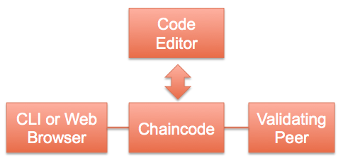
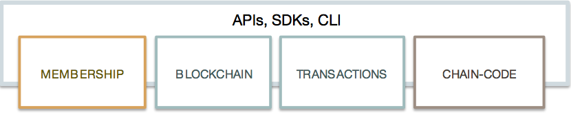
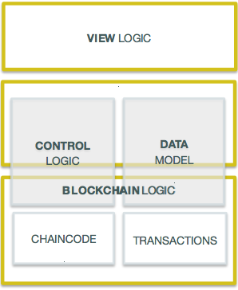

# Protocol Specification

## Preface
This document is the protocol specification for a permissioned blockchain implementation for industry use-cases. It is not intended to be a complete explanation of the implementation, but rather a description of the interfaces and relationships between components in the system and the application.

### Intended Audience
The intended audience for this specification includes the following groups:

- Blockchain vendors who want to implement blockchain systems that conform to this specification
- Tool developers who want to extend the capabilities of the fabric
- Application developers who want to leverage blockchain technologies to enrich their applications

### Authors
The following authors have written sections of this document:  Binh Q Nguyen, Elli Androulaki, Angelo De Caro, Sheehan Anderson, Manish Sethi, Thorsten Kramp, Alessandro Sorniotti, Marko Vukolic, Florian Simon Schubert, Jason K Yellick, Konstantinos Christidis, Srinivasan Muralidharan, Anna D Derbakova, Dulce Ponceleon, David Kravitz, Diego Masini.

### Reviewers
The following reviewers have contributed to this document:  Frank Lu, John Wolpert, Bishop Brock, Nitin Gaur, Sharon Weed, Konrad Pabjan.

### Acknowledgements
The following contributors have provided invaluable technical input to this specification:
Gennaro Cuomo, Joseph A Latone, Christian Cachin
________________________________________________________

## Table of Contents
#### 1. Introduction

   - 1.1 What is the fabric?
   - 1.2 Why the fabric?
   - 1.3 Terminology

#### 2. Fabric

   - 2.1 Architecture
   - 2.1.1 Membership Services
   - 2.1.2 Blockchain Services
   - 2.1.3 Chaincode Services
   - 2.1.4 Events
   - 2.1.5 Application Programming Interface
   - 2.1.6 Command Line Interface
   - 2.2 Topology
   - 2.2.1 Single Validating Peer
   - 2.2.2 Multiple Validating Peers
   - 2.2.3 Multichain

#### 3. Protocol

   - 3.1 Message
   - 3.1.1 Discovery Messages
   - 3.1.2 Transaction Messages
   - 3.1.2.1 Transaction Data Structure
   - 3.1.2.2 Transaction Specification
   - 3.1.2.3 Deploy Transaction
   - 3.1.2.4 Invoke Transaction
   - 3.1.2.5 Query Transaction
   - 3.1.3 Synchronization Messages
   - 3.1.4 Consensus Messages
   - 3.2 Ledger
   - 3.2.1 Blockchain
   - 3.2.1.1 Block
   - 3.2.1.2 Block Hashing
   - 3.2.1.3 NonHashData
   - 3.2.1.4 Transaction
   - 3.2.2 World State
   - 3.2.2.1 Hashing the world state
   - 3.2.2.1.1 Bucket-tree
   - 3.3 Chaincode
   - 3.3.1 Virtual Machine Instantiation
   - 3.3.2 Chaincode Protocol
   - 3.3.2.1 Chaincode Deploy
   - 3.3.2.2 Chaincode Invoke
   - 3.3.2.3 Chaincode Query
   - 3.3.2.4 Chaincode State
   - 3.4 Pluggable Consensus Framework
   - 3.4.1 Consenter interface
   - 3.4.2 Consensus Programming Interface
   - 3.4.3 Inquirer interface
   - 3.4.4 Communicator interface
   - 3.4.5 SecurityUtils interface
   - 3.4.6 LedgerStack interface
   - 3.4.7 Executor interface
   - 3.4.7.1 Beginning a transaction batch
   - 3.4.7.2 Executing transactions
   - 3.4.7.3 Committing and rolling-back transactions
   - 3.4.8 Ledger interface
   - 3.4.8.1 ReadOnlyLedger interface
   - 3.4.8.2 UtilLedger interface
   - 3.4.8.3 WritableLedger interface
   - 3.4.9 RemoteLedgers interface
   - 3.4.10 Controller package
   - 3.4.11 Helper package
   - 3.5 Events
   - 3.4.1 Event Stream
   - 3.4.2 Event Structure
   - 3.4.3 Event Adapters

#### 4. Security
   -  [Security](security-spec.md)

#### 5. Byzantine Consensus
   - 5.1 Overview
   - 5.2 Core PBFT

#### 6. Application Programming Interface
   - 6.1 REST Service
   - 6.2 REST API
   - 6.3 CLI

#### 7. Application Model
   - 7.1 Composition of an Application
   - 7.2 Sample Application

#### 8. Future Directions
   - 8.1 Enterprise Integration
   - 8.2 Performance and Scalability
   - 8.3 Additional Consensus Plugins
   - 8.4 Additional Languages

#### 9. References

________________________________________________________

## 1. Introduction
This document specifies the principles, architecture, and protocol of a blockchain implementation suitable for industrial use-cases.

### 1.1 What is the fabric?
The fabric is a ledger of digital events, called transactions, shared among  different participants, each having a stake in the system. The ledger can only be updated by consensus of the participants, and, once recorded, information can never be altered. Each recorded event is cryptographically verifiable with proof of agreement from the participants.

Transactions are secured, private, and confidential. Each participant registers with proof of identity to the network membership services to gain access to the system. Transactions are issued with derived certificates unlinkable to the individual participant, offering a complete anonymity on the network. Transaction content is encrypted with sophisticated key derivation functions to ensure only intended participants may see the content, protecting the confidentiality of the business transactions.

The ledger allows compliance with regulations as ledger entries are auditable in whole or in part. In collaboration with participants, auditors may obtain time-based certificates to allow viewing the ledger and linking transactions to provide an accurate assessment of the operations.

The fabric is an implementation of blockchain technology, where Bitcoin could be a simple application built on the fabric. It is a modular architecture allowing components to be plug-and-play by implementing this protocol specification. It features powerful container technology to host any main stream language for smart contracts development. Leveraging familiar and proven technologies is the motto of the fabric architecture.

### 1.2 Why the fabric?

Early blockchain technology serves a set of purposes but is often not well-suited for the needs of specific industries. To meet the demands of modern markets, the fabric is based on an industry-focused design that addresses the multiple and varied requirements of specific industry use cases, extending the learning of the pioneers in this field while also addressing issues such as scalability. The fabric provides a new approach to enable permissioned networks, privacy, and confidentially on multiple blockchain networks.

### 1.3 Terminology
The following terminology is defined within the limited scope of this specification to help readers understand clearly and precisely the concepts described here.

**Transaction** is a request to the blockchain to execute a function on the ledger. The function is implemented by a **chaincode**.

**Transactor** is an entity that issues transactions such as a client application.

**Ledger** is a sequence of cryptographically linked blocks, containing transactions and current **world state**.

**World State** is the collection of variables containing the results of executed transactions.

**Chaincode** is an application-level code (a.k.a. [smart contract](https://en.wikipedia.org/wiki/Smart_contract)) stored on the ledger as a part of a transaction. Chaincode runs transactions that may modify the world state.

**Validating Peer** is a computer node on the network responsible for running consensus, validating transactions, and maintaining the ledger.

**Non-validating Peer** is a computer node on the network which functions as a proxy connecting transactors to the neighboring validating peers. A non-validating peer doesn't execute transactions but does verify them. It also hosts the event stream server and the REST service.

**Permissioned Ledger** is a blockchain network where each entity or node is required to be a member of the network. Anonymous nodes are not allowed to connect.

**Privacy** is required by the chain transactors to conceal their identities on the network. While members of the network may examine the transactions, the transactions can't be linked to the transactor without special privilege.

**Confidentiality** is the ability to render the transaction content inaccessible to anyone other than the stakeholders of the transaction.

**Auditability** of the blockchain is required, as business usage of blockchain needs to comply with regulations to make it easy for regulators to investigate transaction records.


## 2. Fabric

The fabric is made up of the core components described in the subsections below.

### 2.1 Architecture
The reference architecture is aligned in 3 categories: Membership, Blockchain, and Chaincode services. These categories are logical structures, not a physical depiction of partitioning of components into separate processes, address spaces or (virtual) machines.


### 2.1.1 Membership Services
Membership provides services for managing identity, privacy, confidentiality and auditability on the network. In a non-permissioned blockchain, participation does not require authorization and all nodes can equally submit transactions and/or attempt to accumulate them into acceptable blocks, i.e. there are no distinctions of roles. Membership services combine elements of Public Key Infrastructure (PKI) and decentralization/consensus to transform a non-permissioned blockchain into a permissioned blockchain. In the latter, entities register in order to acquire long-term identity credentials (enrollment certificates), and may be distinguished according to entity type. In the case of users, such credentials enable the Transaction Certificate Authority (TCA) to issue pseudonymous credentials. Such credentials, i.e., transaction certificates, are used to authorize submitted transactions. Transaction certificates persist on the blockchain, and enable authorized auditors to cluster otherwise unlinkable transactions.  

### 2.1.2 Blockchain Services
Blockchain services manage the distributed ledger through a peer-to-peer protocol, built on HTTP/2. The data structures are highly optimized to provide the most efficient hash algorithm for maintaining the world state replication. Different consensus (PBFT, Raft, PoW, PoS) may be plugged in and configured per deployment.

### 2.1.3 Chaincode Services
Chaincode services provides a secured and lightweight way to sandbox the chaincode execution on the validating nodes. The environment is a “locked down” and secured container along with a set of signed base images containing secure OS and chaincode language, runtime and SDK layers for Go, Java, and Node.js. Other languages can be enabled if required.

### 2.1.4 Events
Validating peers and chaincodes can emit events on the network that applications may listen for and take actions on. There is a set of pre-defined events, and chaincodes can generate custom events. Events are consumed by 1 or more event adapters. Adapters may further deliver events using other vehicles such as Web hooks or Kafka.

### 2.1.5 Application Programming Interface (API)
The primary interface to the fabric is a REST API and its variations over Swagger 2.0. The API allows applications to register users, query the blockchain, and to issue transactions. There is a set of APIs specifically for chaincode to interact with the stack to execute transactions and query transaction results.

### 2.1.6 Command Line Interface (CLI)
CLI includes a subset of the REST API to enable developers to quickly test chaincodes or query for status of transactions. CLI is implemented in Golang and operable on multiple OS platforms.

### 2.2 Topology
A deployment of the fabric can consist of a membership service, many validating peers, non-validating peers, and 1 or more applications. All of these components make up a chain. There can be multiple chains; each one having its own operating parameters and security requirements.

### 2.2.1 Single Validating Peer
Functionally, a non-validating peer is a subset of a validating peer; that is, every capability on a non-validating peer may be enabled on a validating peer, so the simplest network may consist of a single validating peer node. This configuration is most appropriate for a development environment, where a single validating peer may be started up during the edit-compile-debug cycle.



A single validating peer doesn't require consensus, and by default uses the `noops` plugin, which executes transactions as they arrive. This gives the developer an immediate feedback during development.

### 2.2.2 Multiple Validating Peers
Production or test networks should be made up of multiple validating and non-validating peers as necessary. Non-validating peers can take workload off the validating peers, such as handling API requests and processing events.


The validating peers form a mesh-network (every validating peer connects to every other validating peer) to disseminate information. A non-validating peer connects to a neighboring validating peer that it is allowed to connect to. Non-validating peers are optional since applications may communicate directly with validating peers.

### 2.2.3 Multichain
Each network of validating and non-validating peers makes up a chain. Many chains may be created to address different needs, similar to having multiple Web sites, each serving a different purpose.


## 3. Protocol
The fabric's peer-to-peer communication is built on [gRPC](http://www.grpc.io/docs/), which allows bi-directional stream-based messaging. It uses [Protocol Buffers](https://developers.google.com/protocol-buffers) to serialize data structures for data transfer between peers. Protocol buffers are a language-neutral, platform-neutral and extensible mechanism for serializing structured data. Data structures, messages, and services are described using [proto3 language](https://developers.google.com/protocol-buffers/docs/proto3) notation.

### 3.1 Message
Messages passed between nodes are encapsulated by `Message` proto structure, which consists of 4 types: Discovery, Transaction, Synchronization, and Consensus. Each type may define more subtypes embedded in the `payload`.

```
message Message {
   enum Type {
        UNDEFINED = 0;

        DISC_HELLO = 1;
        DISC_DISCONNECT = 2;
        DISC_GET_PEERS = 3;
        DISC_PEERS = 4;
        DISC_NEWMSG = 5;

        CHAIN_STATUS = 6;
        CHAIN_TRANSACTION = 7;
        CHAIN_GET_TRANSACTIONS = 8;
        CHAIN_QUERY = 9;

        SYNC_GET_BLOCKS = 11;
        SYNC_BLOCKS = 12;
        SYNC_BLOCK_ADDED = 13;

        SYNC_STATE_GET_SNAPSHOT = 14;
        SYNC_STATE_SNAPSHOT = 15;
        SYNC_STATE_GET_DELTAS = 16;
        SYNC_STATE_DELTAS = 17;

        RESPONSE = 20;
        CONSENSUS = 21;
    }
    Type type = 1;
    bytes payload = 2;
    google.protobuf.Timestamp timestamp = 3;
}
```
The `payload` is an opaque byte array containing other objects such as `Transaction` or `Response` depending on the type of the message. For example, if the `type` is `CHAIN_TRANSACTION`, the `payload` is a `Transaction` object.

### 3.1.1 Discovery Messages
Upon start up, a peer runs discovery protocol if `CORE_PEER_DISCOVERY_ROOTNODE` is specified. `CORE_PEER_DISCOVERY_ROOTNODE` is the IP address of another peer on the network (any peer) that serves as the starting point for discovering all the peers on the network. The protocol sequence begins with `DISC_HELLO`, whose `payload` is a `HelloMessage` object, containing its endpoint:

```
message HelloMessage {
  PeerEndpoint peerEndpoint = 1;
  uint64 blockNumber = 2;
}
message PeerEndpoint {
    PeerID ID = 1;
    string address = 2;
    enum Type {
      UNDEFINED = 0;
      VALIDATOR = 1;
      NON_VALIDATOR = 2;
    }
    Type type = 3;
    bytes pkiID = 4;
}

message PeerID {
    string name = 1;
}
```

**Definition of fields:**

- `PeerID` is any name given to the peer at start up or defined in the config file
- `PeerEndpoint` describes the endpoint and whether it's a validating or a non-validating peer
- `pkiID` is the cryptographic ID of the peer
- `address` is host or IP address and port of the peer in the format `ip:port`
- `blockNumber` is the height of the blockchain the peer currently has

If the block height received upon `DISC_HELLO` is higher than the current block height of the peer, it immediately initiates the synchronization protocol to catch up with the network.

After `DISC_HELLO`, peer sends `DISC_GET_PEERS` periodically to discover any additional peers joining the network. In response to `DISC_GET_PEERS`, a peer sends `DISC_PEERS` with `payload` containing an array of `PeerEndpoint`. Other discovery message types are not used at this point.

### 3.1.2 Transaction Messages
There are 3 types of transactions: Deploy, Invoke and Query. A deploy transaction installs the specified chaincode on the chain, while invoke and query transactions call a function of a deployed chaincode. Another type in consideration is Create transaction, where a deployed chaincode may be instantiated on the chain and is addressable. This type has not been implemented as of this writing.

### 3.1.2.1 Transaction Data Structure

Messages with type `CHAIN_TRANSACTION` or `CHAIN_QUERY` carry a `Transaction` object in the `payload`:

```
message Transaction {
    enum Type {
        UNDEFINED = 0;
        CHAINCODE_DEPLOY = 1;
        CHAINCODE_INVOKE = 2;
        CHAINCODE_QUERY = 3;
        CHAINCODE_TERMINATE = 4;
    }
    Type type = 1;
    string uuid = 5;
    bytes chaincodeID = 2;
    bytes payloadHash = 3;

    ConfidentialityLevel confidentialityLevel = 7;
    bytes nonce = 8;
    bytes cert = 9;
    bytes signature = 10;

    bytes metadata = 4;
    google.protobuf.Timestamp timestamp = 6;
}

message TransactionPayload {
	bytes payload = 1;
}

enum ConfidentialityLevel {
    PUBLIC = 0;
    CONFIDENTIAL = 1;
}

```
**Definition of fields:**
- `type` - The type of the transaction, which is 1 of the following:
	- `UNDEFINED` - Reserved for future use.
  - `CHAINCODE_DEPLOY` - Represents the deployment of a new chaincode.
	- `CHAINCODE_INVOKE` - Represents a chaincode function execution that may read and modify the world state.
	- `CHAINCODE_QUERY` - Represents a chaincode function execution that may only read the world state.
	- `CHAINCODE_TERMINATE` - Marks a chaincode as inactive so that future functions of the chaincode can no longer be invoked.
- `chaincodeID` - The ID of a chaincode which is a hash of the chaincode source, path to the source code, constructor function, and parameters.
- `payloadHash` - Bytes defining the hash of `TransactionPayload.payload`.
- `metadata` - Bytes defining any associated transaction metadata that the application may use.
- `uuid` - A unique ID for the transaction.
- `timestamp` - A timestamp of when the transaction request was received by the peer.
- `confidentialityLevel` - Level of data confidentiality. There are currently 2 levels. Future releases may define more levels.
- `nonce` - Used for security.
- `cert` - Certificate of the transactor.
- `signature` - Signature of the transactor.
- `TransactionPayload.payload` - Bytes defining the payload of the transaction. As the payload can be large, only the payload hash is included directly in the transaction message.

More detail on transaction security can be found in section 4.

### 3.1.2.2 Transaction Specification
A transaction is always associated with a chaincode specification which defines the chaincode and the execution environment such as language and security context. Currently there is an implementation that uses Golang for writing chaincode. Other languages may be added in the future.

```
message ChaincodeSpec {
    enum Type {
        UNDEFINED = 0;
        GOLANG = 1;
        NODE = 2;
    }
    Type type = 1;
    ChaincodeID chaincodeID = 2;
    ChaincodeInput ctorMsg = 3;
    int32 timeout = 4;
    string secureContext = 5;
    ConfidentialityLevel confidentialityLevel = 6;
    bytes metadata = 7;
}

message ChaincodeID {
    string path = 1;
    string name = 2;
}

message ChaincodeInput {
    string function = 1;
    repeated string args  = 2;
}
```

**Definition of fields:**
- `chaincodeID` - The chaincode source code path and name.
- `ctorMsg` - Function name and argument parameters to call.
- `timeout` - Time in milliseconds to execute the transaction.
- `confidentialityLevel` - Confidentiality level of this transaction.
- `secureContext` - Security context of the transactor.
- `metadata` - Any data the application wants to pass along.

The peer, receiving the `chaincodeSpec`, wraps it in an appropriate transaction message and broadcasts to the network.

### 3.1.2.3 Deploy Transaction
Transaction `type` of a deploy transaction is `CHAINCODE_DEPLOY` and the payload contains an object of `ChaincodeDeploymentSpec`.

```
message ChaincodeDeploymentSpec {
    ChaincodeSpec chaincodeSpec = 1;
    google.protobuf.Timestamp effectiveDate = 2;
    bytes codePackage = 3;
}
```
**Definition of fields:**
- `chaincodeSpec` - See section 3.1.2.2, above.
- `effectiveDate` - Time when the chaincode is ready to accept invocations.
- `codePackage` - gzip of the chaincode source.

The validating peers always verify the hash of the `codePackage` when they deploy the chaincode to make sure the package has not been tampered with since the deploy transaction entered the network.

### 3.1.2.4 Invoke Transaction
Transaction `type` of an invoke transaction is `CHAINCODE_INVOKE` and the `payload` contains an object of `ChaincodeInvocationSpec`.

```
message ChaincodeInvocationSpec {
    ChaincodeSpec chaincodeSpec = 1;
}
```

### 3.1.2.5 Query Transaction
A query transaction is similar to an invoke transaction, but the message `type` is `CHAINCODE_QUERY`.

### 3.1.3 Synchronization Messages
Synchronization protocol starts with discovery, described above in section 3.1.1, when a peer realizes that it's behind or its current block is not the same with others. A peer broadcasts either `SYNC_GET_BLOCKS`, `SYNC_STATE_GET_SNAPSHOT`, or `SYNC_STATE_GET_DELTAS` and receives `SYNC_BLOCKS`, `SYNC_STATE_SNAPSHOT`, or `SYNC_STATE_DELTAS` respectively.

The installed consensus plugin (e.g. pbft) dictates how synchronization protocol is being applied. Each message is designed for a specific situation:

**SYNC_GET_BLOCKS** requests for a range of contiguous blocks expressed in the message `payload`, which is an object of `SyncBlockRange`.  The correlationId specified is included in the `SyncBlockRange` of any replies to this message.
```
message SyncBlockRange {
    uint64 correlationId = 1;
    uint64 start = 2;
    uint64 end = 3;
}
```
A receiving peer responds with a `SYNC_BLOCKS` message whose `payload` contains an object of `SyncBlocks`
```
message SyncBlocks {
    SyncBlockRange range = 1;
    repeated Block blocks = 2;
}
```
The `start` and `end` indicate the starting and ending blocks inclusively. The order in which blocks are returned is defined by the `start` and `end` values. For example, if `start`=3 and `end`=5, the order of blocks will be 3, 4, 5. If `start`=5 and `end`=3, the order will be 5, 4, 3.

**SYNC_STATE_GET_SNAPSHOT** requests for the snapshot of the current world state. The `payload` is an object of `SyncStateSnapshotRequest`
```
message SyncStateSnapshotRequest {
  uint64 correlationId = 1;
}
```
The `correlationId` is used by the requesting peer to keep track of the response messages. A receiving peer replies with `SYNC_STATE_SNAPSHOT` message whose `payload` is an instance of `SyncStateSnapshot`
```
message SyncStateSnapshot {
    bytes delta = 1;
    uint64 sequence = 2;
    uint64 blockNumber = 3;
    SyncStateSnapshotRequest request = 4;
}
```
This message contains the snapshot or a chunk of the snapshot on the stream, and in which case, the sequence indicate the order starting at 0.  The terminating message will have len(delta) == 0.

**SYNC_STATE_GET_DELTAS** requests for the state deltas of a range of contiguous blocks. By default, the Ledger maintains 500 transition deltas. A delta(j) is a state transition between block(i) and block(j) where i = j-1. The message `payload` contains an instance of `SyncStateDeltasRequest`
```
message SyncStateDeltasRequest {
    SyncBlockRange range = 1;
}
```
A receiving peer responds with `SYNC_STATE_DELTAS`, whose `payload` is an instance of `SyncStateDeltas`
```
message SyncStateDeltas {
    SyncBlockRange range = 1;
    repeated bytes deltas = 2;
}
```
A delta may be applied forward (from i to j) or backward (from j to i) in the state transition.

### 3.1.4 Consensus Messages
Consensus deals with transactions, so a `CONSENSUS` message is initiated internally by the consensus framework when it receives a `CHAIN_TRANSACTION` message. The framework converts `CHAIN_TRANSACTION` into `CONSENSUS` then broadcasts to the validating nodes with the same `payload`. The consensus plugin receives this message and process according to its internal algorithm. The plugin may create custom subtypes to manage consensus finite state machine. See section 3.4 for more details.


### 3.2 Ledger

The ledger consists of two primary pieces, the blockchain and the world state. The blockchain is a series of linked blocks that is used to record transactions within the ledger. The world state is a key-value database that chaincodes may use to store state when executed by a transaction.

### 3.2.1 Blockchain

#### 3.2.1.1 Block

The blockchain is defined as a linked list of blocks as each block contains the hash of the previous block in the chain. The two other important pieces of information that a block contains are the list of transactions contained within the block and the hash of the world state after executing all transactions in the block.

```
message Block {
  version = 1;
  google.protobuf.Timestamp timestamp = 2;
  bytes transactionsHash = 3;
  bytes stateHash = 4;
  bytes previousBlockHash = 5;
  bytes consensusMetadata = 6;
  NonHashData nonHashData = 7;
}

message BlockTransactions {
  repeated Transaction transactions = 1;
}
```
* `version` - Version used to track any protocol changes.
* `timestamp` - The timestamp to be filled in by the block proposer.
* `transactionsHash` - The merkle root hash of the block's transactions.
* `stateHash` - The merkle root hash of the world state.
* `previousBlockHash` - The hash of the previous block.
* `consensusMetadata` - Optional metadata that the consensus may include in a block.
* `nonHashData` - A `NonHashData` message that is set to nil before computing the hash of the block, but stored as part of the block in the database.
* `BlockTransactions.transactions` - An array of Transaction messages. Transactions are not included in the block directly due to their size.

#### 3.2.1.2 Block Hashing

* The `previousBlockHash` hash is calculated using the following algorithm.
  1. Serialize the Block message to bytes using the protocol buffer library.

  2. Hash the serialized block message to 512 bits of output using the SHA3 SHAKE256 algorithm as described in [FIPS 202](http://nvlpubs.nist.gov/nistpubs/FIPS/NIST.FIPS.202.pdf).

* The `transactionHash` is the root of the transaction merkle tree. Defining the merkle tree implementation is a TODO.

* The `stateHash` is defined in section 3.2.2.1.

#### 3.2.1.3 NonHashData

The NonHashData message is used to store block metadata that is not required to be the same value on all peers. These are suggested values.

```
message NonHashData {
  google.protobuf.Timestamp localLedgerCommitTimestamp = 1;
  repeated TransactionResult transactionResults = 2;
}

message TransactionResult {
  string uuid = 1;
  bytes result = 2;
  uint32 errorCode = 3;
  string error = 4;
}
```

* `localLedgerCommitTimestamp` - A timestamp indicating when the block was commited to the local ledger.

* `TransactionResult` - An array of transaction results.

* `TransactionResult.uuid` - The ID of the transaction.

* `TransactionResult.result` - The return value of the transaction.

* `TransactionResult.errorCode` - A code that can be used to log errors associated with the transaction.

* `TransactionResult.error` - A string that can be used to log errors associated with the transaction.


#### 3.2.1.4 Transaction Execution

A transaction defines either the deployment of a chaincode or the execution of a chaincode. All transactions within a block are run before recording a block in the ledger. When chaincodes execute, they may modify the world state. The hash of the world state is then recorded in the block.


### 3.2.2 World State
The *world state* of a peer refers to the collection of the *states* of all the deployed chaincodes. Further, the state of a chaincode is represented as a collection of key-value pairs. Thus, logically, the world state of a peer is also a collection of key-value pairs where key consists of a tuple `{chaincodeID, ckey}`. Here, we use the term `key` to represent a key in the world state i.e., a tuple `{chaincodeID, ckey}` and we use the term `cKey` to represent a unique key within a chaincode.

For the purpose of the description below, `chaincodeID` is assumed to be a valid utf8 string and `ckey` and the `value` can be a sequence of one or more arbitrary bytes.

#### 3.2.2.1 Hashing the world state
During the functioning of a network, many occasions such as committing transactions and synchronizing peers may require computing a crypto-hash of the world state observed by a peer. For instance, the consensus protocol may require to ensure that a *minimum* number of peers in the network observe the same world state.

Since, computing the crypto-hash of the world state could be an expensive operation, this is highly desirable to organize the world state such that it enables an efficient crypto-hash computation of the world state when a change occurs in the world state. Further, different organization designs may be suitable under different workloads conditions.

Because the fabric is expected to function under a variety of scenarios leading to different workloads conditions, a pluggable mechanism is supported for organizing the world state.

#### 3.2.2.1.1 Bucket-tree

*Bucket-tree* is one of the implementations for organizing the world state. For the purpose of the description below, a key in the world state is represented as a concatenation of the two components (`chaincodeID` and `ckey`)  separated by a `nil` byte i.e., `key` = `chaincodeID`+`nil`+`cKey`.

This method models a *merkle-tree* on top of buckets of a *hash table* in order to compute the crypto-hash of the *world state*.

At the core of this method, the *key-values* of the world state are assumed to be stored in a hash-table that consists of a pre-decided number of buckets (`numBuckets`). A hash function (`hashFunction`) is employed to determine the bucket number that should contain a given key. Please note that the `hashFunction` does not represent a crypto-hash method such as SHA3, rather this is a regular programming language hash function that decides the bucket number for a given key.

For modeling the merkle-tree, the ordered buckets act as leaf nodes of the tree - lowest numbered bucket being the left most leaf node in the tree. For constructing the second-last level of the tree, a pre-decided number of leaf nodes (`maxGroupingAtEachLevel`), starting from left, are grouped together and for each such group, a node is inserted at the second-last level that acts as a common parent for all the leaf nodes in the group. Note that the number of children for the last parent node may be less than `maxGroupingAtEachLevel`. This grouping method of constructing the next higher level is repeated until the root node of the tree is constructed.

An example setup with configuration `{numBuckets=10009 and maxGroupingAtEachLevel=10}` will result in a tree with number of nodes at different level as depicted in the following table.

| Level         | Number of nodes |
| ------------- |:---------------:|
| 0             | 1               |
| 1             | 2               |
| 2             | 11              |
| 3             | 101             |
| 4             | 1001            |
| 5             | 10009           |

For computing the crypto-hash of the world state, the crypto-hash of each bucket is computed and is assumed to be the crypto-hash of leaf-nodes of the merkle-tree. In order to compute crypto-hash of a bucket, the key-values present in the bucket are first serialized and crypto-hash function is applied on the serialized bytes. For serializing the key-values of a bucket, all the key-values with a common chaincodeID prefix are serialized separately and then appending together, in the ascending order of chaincodeIDs. For serializing the key-values of a chaincodeID, the following information is concatenated:
   1. Length of chaincodeID (number of bytes in the chaincodeID)
   - The utf8 bytes of the chaincodeID
   - Number of key-values for the chaincodeID
   - For each key-value (in sorted order of the ckey)
      - Length of the ckey
      - ckey bytes
      - Length of the value
      - value bytes

For all the numeric types in the above list of items (e.g., Length of chaincodeID), protobuf's varint encoding is assumed to be used. The purpose of the above encoding is to achieve a byte representation of the key-values within a bucket that can not be arrived at by any other combination of key-values and also to reduce the overall size of the serialized bytes.

For example, consider a bucket that contains three key-values namely, `chaincodeID1_key1:value1, chaincodeID1_key2:value2, and chaincodeID2_key1:value1`. The serialized bytes for the bucket would logically look as - `12 + chaincodeID1 + 2 + 4 + key1 + 6 + value1 + 4 + key2 + 6 + value2 + 12 + chaincodeID2 + 1 + 4 + key1 + 6 + value1`

If a bucket has no key-value present, the crypto-hash is considered as `nil`.

The crypto-hash of an intermediate node and root node are computed just like in a standard merkle-tree i.e., applying a crypto-hash function on the bytes obtained by concatenating the crypto-hash of all the children nodes, from left to right. Further, if a child has a crypto-hash as `nil`, the crypto-hash of the child is omitted when concatenating the children crypto-hashes. If the node has a single child, the crypto-hash of the child is assumed to be the crypto-hash of the node. Finally, the crypto-hash of the root node is considered as the crypto-hash of the world state.

The above method offers performance benefits for computing crypto-hash when a few key-values change in the state. The major benefits include
  - Computation of crypto-hashes of the unchanged buckets can be skipped
  - The depth and breadth of the merkle-tree can be controlled by configuring the parameters `numBuckets` and `maxGroupingAtEachLevel`. Both depth and breadth of the tree has different implication on the performance cost incurred by and resource demand of different resources (namely - disk I/O, storage, and memory)

In a particular deployment, all the peer nodes are expected to use same values for the configurations `numBuckets, maxGroupingAtEachLevel, and hashFunction`. Further, if any of these configurations are to be changed at a later stage, the configurations should be changed on all the peer nodes so that the comparison of crypto-hashes across peer nodes is meaningful. Also, this may require to migrate the existing data based on the implementation. For example, an implementation is expected to store the last computed crypto-hashes for all the nodes in the tree which would need to be recalculated.


### 3.3 Chaincode
Chaincode is an application-level code deployed as a transaction (see section 3.1.2) to be distributed to the network and managed by each validating peer as isolated sandbox. Though any virtualization technology can support the sandbox, currently Docker container is utilized to run the chaincode. The protocol described in this section enables different virtualization support implementation to plug and play.

### 3.3.1 Virtual Machine Instantiation
A virtual machine implements the VM interface:  
```
type VM interface {
	build(ctxt context.Context, id string, args []string, env []string, attachstdin bool, attachstdout bool, reader io.Reader) error
	start(ctxt context.Context, id string, args []string, env []string, attachstdin bool, attachstdout bool) error
	stop(ctxt context.Context, id string, timeout uint, dontkill bool, dontremove bool) error
}
```
The fabric instantiates the VM when it processes a Deploy transaction or other transactions on the chaincode while the VM for that chaincode is not running (either crashed or previously brought down due to inactivity). Each chaincode image is built by the `build` function, started by `start` and stopped by `stop` function.

Once the chaincode container is up, it makes a gRPC connection back to the validating peer that started the chaincode, and that establishes the channel for Invoke and Query transactions on the chaincode.

### 3.3.2 Chaincode Protocol
Communication between a validating peer and its chaincodes is based on a bidirectional gRPC stream. There is a shim layer on the chaincode container to handle the message protocol between the chaincode and the validating peer using protobuf message.
```
message ChaincodeMessage {

    enum Type {
        UNDEFINED = 0;
        REGISTER = 1;
        REGISTERED = 2;
        INIT = 3;
        READY = 4;
        TRANSACTION = 5;
        COMPLETED = 6;
        ERROR = 7;
        GET_STATE = 8;
        PUT_STATE = 9;
        DEL_STATE = 10;
        INVOKE_CHAINCODE = 11;
        INVOKE_QUERY = 12;
        RESPONSE = 13;
        QUERY = 14;
        QUERY_COMPLETED = 15;
        QUERY_ERROR = 16;
        RANGE_QUERY_STATE = 17;
    }

    Type type = 1;
    google.protobuf.Timestamp timestamp = 2;
    bytes payload = 3;
    string uuid = 4;
}
```

**Definition of fields:**
- `Type` is the type of the message.
- `payload` is the payload of the message. Each payload depends on the `Type`.
- `uuid` is a unique identifier of the message.

The message types are described in the following sub-sections.

A chaincode implements the `Chaincode` interface, which is called by the validating peer when it processes Deploy, Invoke or Query transactions.

```
type Chaincode interface {
i	Init(stub *ChaincodeStub, function string, args []string) ([]byte, error)
	Invoke(stub *ChaincodeStub, function string, args []string) ([]byte, error)
	Query(stub *ChaincodeStub, function string, args []string) ([]byte, error)
}
```

`Init`, `Invoke` and `Query` functions take `function` and `args` as parameters to be used by those methods to support a variety of transactions. `Init` is a constructor function, which will only be invoked by the Deploy transaction. The `Query` function is not allowed to modify the state of the chaincode; it can only read and calculate the return value as a byte array.

### 3.3.2.1 Chaincode Deploy
Upon deploy (chaincode container is started), the shim layer sends a one time `REGISTER` message to the validating peer with the `payload` containing the `ChaincodeID`. The validating peer responds with `REGISTERED` or `ERROR` on success or failure respectively. The shim closes the connection and exits if it receives an `ERROR`.

After registration, the validating peer sends `INIT` with the `payload` containing a `ChaincodeInput` object. The shim calls the `Init` function with the parameters from the `ChaincodeInput`, enabling the chaincode to perform any initialization, such as setting up the persistent state.

The shim responds with `RESPONSE` or `ERROR` message depending on the returned value from the chaincode `Init` function. If there are no errors, the chaincode initialization is complete and is ready to receive Invoke and Query transactions.

### 3.3.2.2 Chaincode Invoke
When processing an invoke transaction, the validating peer sends a `TRANSACTION` message to the chaincode container shim, which in turn calls the chaincode `Invoke` function, passing the parameters from the `ChaincodeInput` object. The shim responds to the validating peer with `RESPONSE` or `ERROR` message, indicating the completion of the function. If `ERROR` is received, the `payload` contains the error message generated by the chaincode.

### 3.3.2.3 Chaincode Query
Similar to an invoke transaction, when processing a query, the validating peer sends a `QUERY` message to the chaincode container shim, which in turn calls the chaincode `Query` function, passing the parameters from the `ChaincodeInput` object. The `Query` function may return a state value or an error, which the shim forwards to the validating peer using `RESPONSE` or `ERROR` messages respectively.

### 3.3.2.4 Chaincode State
Each chaincode may define its own persistent state variables. For example, a chaincode may create assets such as TVs, cars, or stocks using state variables to hold the assets attributes. During `Invoke` function processing, the chaincode may update the state variables, for example, changing an asset owner. A chaincode manipulates the state variables by using the following message types:

#### PUT_STATE
Chaincode sends a `PUT_STATE` message to persist a key-value pair, with the `payload` containing `PutStateInfo` object.

```
message PutStateInfo {
    string key = 1;
    bytes value = 2;
}
```

#### GET_STATE
Chaincode sends a `GET_STATE` message to retrieve the value whose key is specified in the `payload`.

#### DEL_STATE
Chaincode sends a `DEL_STATE` message to delete the value whose key is specified in the `payload`.

#### RANGE_QUERY_STATE
Chaincode sends a `RANGE_QUERY_STATE` message to get a range of values. The message `payload` contains a `RangeQueryStateInfo` object.

```
message RangeQueryState {
	string startKey = 1;
	string endKey = 2;
}
```

The `startKey` and `endKey` are inclusive and assumed to be in lexical order. The validating peer responds with `RESPONSE` message whose `payload` is a `RangeQueryStateResponse` object.

```
message RangeQueryStateResponse {
    repeated RangeQueryStateKeyValue keysAndValues = 1;
    bool hasMore = 2;
    string ID = 3;
}
message RangeQueryStateKeyValue {
    string key = 1;
    bytes value = 2;
}
```

If `hasMore=true` in the response, this indicates that additional keys are available in the requested range. The chaincode can request the next set of keys and values by sending a `RangeQueryStateNext` message with an ID that matches the ID returned in the response.

```
message RangeQueryStateNext {
    string ID = 1;
}
```

When the chaincode is finished reading from the range, it should send a `RangeQueryStateClose` message with the ID it wishes to close.

```
message RangeQueryStateClose {
  string ID = 1;
}
```

#### INVOKE_CHAINCODE
Chaincode may call another chaincode in the same transaction context by sending an `INVOKE_CHAINCODE` message to the validating peer with the `payload` containing a `ChaincodeSpec` object.

#### QUERY_CHAINCODE
Chaincode may query another chaincode in the same transaction context by sending a `QUERY_CHAINCODE` message with the `payload` containing a `ChaincodeSpec` object.


### 3.4 Pluggable Consensus Framework

The consensus framework defines the interfaces that every consensus _plugin_ implements:

  - `consensus.Consenter`: interface that  allows consensus plugin to receive messages from the network.
  - `consensus.CPI`:  _Consensus Programming Interface_ (`CPI`) is used by consensus plugin to interact with rest of the stack. This interface is split in two parts:
	  - `consensus.Communicator`: used to send (broadcast and unicast) messages to other validating peers.
	  - `consensus.LedgerStack`: which is used as an interface to the execution framework as well as the ledger.

As described below in more details, `consensus.LedgerStack` encapsulates, among other interfaces, the `consensus.Executor` interface, which is the key part of the consensus framework. Namely, `consensus.Executor` interface allows for a (batch of) transaction to be started, executed, rolled back if necessary, previewed, and potentially committed. A particular property that every consensus plugin needs to satisfy is that batches (blocks)  of transactions are committed to the ledger (via `consensus.Executor.CommitTxBatch`) in total order across all validating peers (see `consensus.Executor` interface description below for more details).

Currently, consensus framework consists of 3 packages `consensus`, `controller`, and `helper`. The primary reason for `controller` and `helper` packages is to avoid "import cycle" in Go (golang) and minimize code changes for plugin to update.

- `controller` package specifies the consensus plugin used by a validating peer.
- `helper` package is a shim around a consensus plugin that helps it interact with the rest of the stack, such as maintaining message handlers to other peers.  

There are 2 consensus plugins provided: `pbft` and `noops`:

-  `pbft` package contains consensus plugin that implements the *PBFT* [1] consensus protocol. See section 5 for more detail.
-  `noops` is a ''dummy'' consensus plugin for development and test purposes. It doesn't perform consensus but processes all consensus messages. It also serves as a good simple sample to start learning how to code a consensus plugin.


### 3.4.1 `Consenter` interface

Definition:
```
type Consenter interface {
	RecvMsg(msg *pb.Message) error
}
```
The plugin's entry point for (external) client requests, and consensus messages generated internally (i.e. from the consensus module) during the consensus process. The `controller.NewConsenter` creates the plugin `Consenter`. `RecvMsg` processes the incoming transactions in order to reach consensus.

See `helper.HandleMessage` below to understand how the peer interacts with this interface.

### 3.4.2 `CPI` interface

Definition:
```
type CPI interface {
	Inquirer
	Communicator
	SecurityUtils
	LedgerStack
}
```
`CPI` allows the plugin to interact with the stack. It is implemented by the `helper.Helper` object. Recall that this object:

  1. Is instantiated when the `helper.NewConsensusHandler` is called.
  2. Is accessible to the plugin author when they construct their plugin's `consensus.Consenter` object.

### 3.4.3 `Inquirer` interface

Definition:
```
type Inquirer interface {
        GetNetworkInfo() (self *pb.PeerEndpoint, network []*pb.PeerEndpoint, err error)
        GetNetworkHandles() (self *pb.PeerID, network []*pb.PeerID, err error)
}
```
This interface is a part of the `consensus.CPI` interface. It is used to get the handles of the validating peers in the network (`GetNetworkHandles`) as well as details about the those validating peers (`GetNetworkInfo`):

Note that the peers are identified by a `pb.PeerID` object. This is a protobuf message (in the `protos` package), currently defined as (notice that this definition will likely be modified):

```
message PeerID {
    string name = 1;
}
```

### 3.4.4 `Communicator` interface

Definition:

```
type Communicator interface {
	Broadcast(msg *pb.Message) error
	Unicast(msg *pb.Message, receiverHandle *pb.PeerID) error
}
```

This interface is a part of the `consensus.CPI` interface. It is used to communicate with other peers on the network (`helper.Broadcast`, `helper.Unicast`):

### 3.4.5 `SecurityUtils` interface

Definition:

```
type SecurityUtils interface {
        Sign(msg []byte) ([]byte, error)
        Verify(peerID *pb.PeerID, signature []byte, message []byte) error
}
```

This interface is a part of the `consensus.CPI` interface. It is used to handle the cryptographic operations of message signing (`Sign`) and verifying signatures (`Verify`)

### 3.4.6 `LedgerStack` interface

Definition:

```
type LedgerStack interface {
	Executor
	Ledger
	RemoteLedgers
}
```

A key member of the `CPI` interface, `LedgerStack` groups interaction of consensus with the rest of the fabric, such as the execution of transactions, querying, and updating the ledger.  This interface supports querying the local blockchain and state, updating the local blockchain and state, and querying the blockchain and state of other nodes in the consensus network. It consists of three parts: `Executor`, `Ledger` and `RemoteLedgers` interfaces. These are described in the following.

### 3.4.7 `Executor` interface

Definition:

```
type Executor interface {
	BeginTxBatch(id interface{}) error
	ExecTXs(id interface{}, txs []*pb.Transaction) ([]byte, []error)  
	CommitTxBatch(id interface{}, transactions []*pb.Transaction, transactionsResults []*pb.TransactionResult, metadata []byte) error  
	RollbackTxBatch(id interface{}) error  
	PreviewCommitTxBatchBlock(id interface{}, transactions []*pb.Transaction, metadata []byte) (*pb.Block, error)  
}
```

The executor interface is the most frequently utilized portion of the `LedgerStack` interface, and is the only piece which is strictly necessary for a consensus network to make progress.  The interface allows for a transaction to be started, executed, rolled back if necessary, previewed, and potentially committed.  This interface is comprised of the following methods.

#### 3.4.7.1 Beginning a transaction batch

```
BeginTxBatch(id interface{}) error
```

This call accepts an arbitrary `id`, deliberately opaque, as a way for the consensus plugin to ensure only the transactions associated with this particular batch are executed. For instance, in the pbft implementation, this `id` is the an encoded hash of the transactions to be executed.

#### 3.4.7.2 Executing transactions

```
ExecTXs(id interface{}, txs []*pb.Transaction) ([]byte, []error)
```

This call accepts an array of transactions to execute against the current state of the ledger and returns the current state hash in addition to an array of errors corresponding to the array of transactions.  Note that a transaction resulting in an error has no effect on whether a transaction batch is safe to commit.  It is up to the consensus plugin to determine the behavior which should occur when failing transactions are encountered.  This call is safe to invoke multiple times.

#### 3.4.7.3 Committing and rolling-back transactions

```
RollbackTxBatch(id interface{}) error
```

This call aborts an execution batch.  This will undo the changes to the current state, and restore the ledger to its previous state.  It concludes the batch begun with `BeginBatchTx` and a new one must be created before executing any transactions.

```
PreviewCommitTxBatchBlock(id interface{}, transactions []*pb.Transaction, metadata []byte) (*pb.Block, error)
```

This call is most useful for consensus plugins which wish to test for non-deterministic transaction execution.  The hashable portions of the block returned are guaranteed to be identical to the block which would be committed if `CommitTxBatch` were immediately invoked.  This guarantee is violated if any new transactions are executed.

```
CommitTxBatch(id interface{}, transactions []*pb.Transaction, transactionsResults []*pb.TransactionResult, metadata []byte) error
```

This call commits a block to the blockchain.  Blocks must be committed to a blockchain in total order. ``CommitTxBatch`` concludes the transaction batch, and a new call to `BeginTxBatch` must be made before any new transactions are executed and committed.


### 3.4.8 `Ledger` interface

Definition:

```
type Ledger interface {
	ReadOnlyLedger
	UtilLedger
	WritableLedger
}
```

``Ledger`` interface is intended to allow the consensus plugin to interrogate and possibly update the current state and blockchain. It is comprised of the three interfaces described below.

#### 3.4.8.1 `ReadOnlyLedger` interface

Definition:

```
type ReadOnlyLedger interface {
	GetBlock(id uint64) (block *pb.Block, err error)
	GetCurrentStateHash() (stateHash []byte, err error)
	GetBlockchainSize() (uint64, error)
}
```

`ReadOnlyLedger` interface is intended to query the local copy of the ledger without the possibility of modifying it.  It is comprised of the following functions.

```
GetBlockchainSize() (uint64, error)
```

This call returns the current length of the blockchain ledger.  In general, this function should never fail, though in the unlikely event that this occurs, the error is passed to the caller to decide what if any recovery is necessary.  The block with the highest number will have block number `GetBlockchainSize()-1`.  

Note that in the event that the local copy of the blockchain ledger is corrupt or incomplete, this call will return the highest block number in the chain, plus one.  This allows for a node to continue operating from the current state/block even when older blocks are corrupt or missing.

```
GetBlock(id uint64) (block *pb.Block, err error)
```

This call returns the block from the blockchain with block number `id`.  In general, this call should not fail, except when the block queried exceeds the current blocklength, or when the underlying blockchain has somehow become corrupt.  A failure of `GetBlock` has a possible resolution of using the state transfer mechanism to retrieve it.


```
GetCurrentStateHash() (stateHash []byte, err error)
```

This call returns the current state hash for the ledger.  In general, this function should never fail, though in the unlikely event that this occurs, the error is passed to the caller to decide what if any recovery is necessary.


#### 3.4.8.2 `UtilLedger` interface

Definition:

```
type UtilLedger interface {
	HashBlock(block *pb.Block) ([]byte, error)
	VerifyBlockchain(start, finish uint64) (uint64, error)
}
```

`UtilLedger`  interface defines some useful utility functions which are provided by the local ledger.  Overriding these functions in a mock interface can be useful for testing purposes.  This interface is comprised of two functions.

```
HashBlock(block *pb.Block) ([]byte, error)
```

Although `*pb.Block` has a `GetHash` method defined, for mock testing, overriding this method can be very useful.  Therefore, it is recommended that the `GetHash` method never be directly invoked, but instead invoked via this `UtilLedger.HashBlock` interface.  In general, this method should never fail, but the error is still passed to the caller to decide what if any recovery is appropriate.

```
VerifyBlockchain(start, finish uint64) (uint64, error)
```

This utility method is intended for verifying large sections of the blockchain.  It proceeds from a high block `start` to a lower block `finish`, returning the block number of the first block whose `PreviousBlockHash` does not match the block hash of the previous block as well as an error.  Note, this generally indicates the last good block number, not the first bad block number.


#### 3.4.8.3 `WritableLedger` interface

Definition:

```
type WritableLedger interface {
	PutBlock(blockNumber uint64, block *pb.Block) error
	ApplyStateDelta(id interface{}, delta *statemgmt.StateDelta) error
	CommitStateDelta(id interface{}) error
	RollbackStateDelta(id interface{}) error
	EmptyState() error
}
```

`WritableLedger`  interface allows for the caller to update the blockchain.  Note that this is _NOT_ intended for use in normal operation of a consensus plugin.  The current state should be modified by executing transactions using the `Executor` interface, and new blocks will be generated when transactions are committed.  This interface is instead intended primarily for state transfer or corruption recovery.  In particular, functions in this interface should _NEVER_ be exposed directly via consensus messages, as this could result in violating the immutability promises of the blockchain concept.  This interface is comprised of the following functions.

  -
  	```
	PutBlock(blockNumber uint64, block *pb.Block) error
	```

	This function takes a provided, raw block, and inserts it into the blockchain at the given blockNumber.  Note that this intended to be an unsafe interface, so no error or sanity checking is performed.  Inserting a block with a number higher than the current block height is permitted, similarly overwriting existing already committed blocks is also permitted.  Remember, this does not affect the auditability or immutability of the chain, as the hashing techniques make it computationally infeasible to forge a block earlier in the chain.  Any attempt to rewrite the blockchain history is therefore easily detectable.  This is generally only useful to the state transfer API.

  -
  	```
	ApplyStateDelta(id interface{}, delta *statemgmt.StateDelta) error
	```

	This function takes a state delta, and applies it to the current state.  The delta will be applied to transition a state forward or backwards depending on the construction of the state delta.  Like the `Executor` methods, `ApplyStateDelta` accepts an opaque interface `id` which should also be passed into `CommitStateDelta` or `RollbackStateDelta` as appropriate.

  -
 	```
	CommitStateDelta(id interface{}) error
	```

	This function commits the state delta which was applied in `ApplyStateDelta`.  This is intended to be invoked after the caller to `ApplyStateDelta` has verified the state via the state hash obtained via `GetCurrentStateHash()`.  This call takes the same `id` which was passed into `ApplyStateDelta`.

  -
  	```
	RollbackStateDelta(id interface{}) error
	```

	This function unapplies a state delta which was applied in `ApplyStateDelta`.  This is intended to be invoked after the caller to `ApplyStateDelta` has detected the state hash obtained via `GetCurrentStateHash()` is incorrect.  This call takes the same `id` which was passed into `ApplyStateDelta`.


  -
  	```
   	EmptyState() error
   	```

	This function will delete the entire current state, resulting in a pristine empty state.  It is intended to be called before loading an entirely new state via deltas.  This is generally only useful to the state transfer API.

### 3.4.9 `RemoteLedgers` interface

Definition:

```
type RemoteLedgers interface {
	GetRemoteBlocks(peerID uint64, start, finish uint64) (<-chan *pb.SyncBlocks, error)
	GetRemoteStateSnapshot(peerID uint64) (<-chan *pb.SyncStateSnapshot, error)
	GetRemoteStateDeltas(peerID uint64, start, finish uint64) (<-chan *pb.SyncStateDeltas, error)
}
```

The `RemoteLedgers` interface exists primarily to enable state transfer and to interrogate the blockchain state at  other replicas.  Just like the `WritableLedger` interface, it is not intended to be used in normal operation and is designed to be used for catchup, error recovery, etc.  For all functions in this interface it is the caller's responsibility to enforce timeouts.  This interface contains the following functions.

  -  
  	```
  	GetRemoteBlocks(peerID uint64, start, finish uint64) (<-chan *pb.SyncBlocks, error)
  	```

	This function attempts to retrieve a stream of `*pb.SyncBlocks` from the peer designated by `peerID` for the range from `start` to `finish`.  In general, `start` should be specified with a higher block number than `finish`, as the blockchain must be validated from end to beginning.  The caller must validate that the desired block is being returned, as it is possible that slow results from another request could appear on this channel.  Invoking this call for the same `peerID` a second time will cause the first channel to close.

  -  
  	```
   	GetRemoteStateSnapshot(peerID uint64) (<-chan *pb.SyncStateSnapshot, error)
   	```

	This function attempts to retrieve a stream of `*pb.SyncStateSnapshot` from the peer designated by `peerID`.  To apply the result, the existing state should first be emptied via the `WritableLedger` `EmptyState` call, then the contained deltas in the stream should be applied sequentially.

  -
  	```
   	GetRemoteStateDeltas(peerID uint64, start, finish uint64) (<-chan *pb.SyncStateDeltas, error)
   	```

	This function attempts to retrieve a stream of `*pb.SyncStateDeltas` from the peer designated by `peerID` for the range from `start` to `finish`.  The caller must validated that the desired block delta is being returned, as it is possible that slow results from another request could appear on this channel.  Invoking this call for the same `peerID` a second time will cause the first channel to close.

### 3.4.10 `controller` package

#### 3.4.10.1 controller.NewConsenter

Signature:

```
func NewConsenter(cpi consensus.CPI) (consenter consensus.Consenter)
```

This function reads the `peer.validator.consensus` value in `core.yaml` configuration file, which is the  configuration file for the `peer` process. The value of the `peer.validator.consensus` key defines whether the validating peer will run with the `noops` consensus plugin or the `pbft` one. (Notice that this should eventually be changed to either `noops` or `custom`. In case of `custom`, the validating peer will run with the consensus plugin defined in `consensus/config.yaml`.)

The plugin author needs to edit the function's body so that it routes to the right constructor for their package. For example, for `pbft` we point to the `obcpft.GetPlugin` constructor.

This function is called by `helper.NewConsensusHandler` when setting the `consenter` field of the returned message handler. The input argument `cpi` is the output of the `helper.NewHelper` constructor and implements the `consensus.CPI` interface.

### 3.4.11 `helper` package

#### 3.4.11.1 High-level overview

A validating peer establishes a message handler (`helper.ConsensusHandler`) for every connected peer, via the `helper.NewConsesusHandler` function (a handler factory). Every incoming message is inspected on its type (`helper.HandleMessage`); if it's a message for which consensus needs to be reached, it's passed on to the peer's consenter object (`consensus.Consenter`). Otherwise it's passed on to the next message handler in the stack.

#### 3.4.11.2 helper.ConsensusHandler

Definition:

```
type ConsensusHandler struct {
	chatStream  peer.ChatStream
	consenter   consensus.Consenter
	coordinator peer.MessageHandlerCoordinator
	done        chan struct{}
	peerHandler peer.MessageHandler
}
```

Within the context of consensus, we focus only on the `coordinator` and `consenter` fields. The `coordinator`, as the name implies, is used to coordinate between the peer's message handlers. This is, for instance, the object that is accessed when the peer wishes to `Broadcast`. The `consenter` receives the messages for which consensus needs to be reached and processes them.

Notice that `fabric/peer/peer.go` defines the `peer.MessageHandler` (interface), and `peer.MessageHandlerCoordinator` (interface) types.

#### 3.4.11.3 helper.NewConsensusHandler

Signature:

```
func NewConsensusHandler(coord peer.MessageHandlerCoordinator, stream peer.ChatStream, initiatedStream bool, next peer.MessageHandler) (peer.MessageHandler, error)
```

Creates a `helper.ConsensusHandler` object. Sets the same `coordinator` for every message handler. Also sets the `consenter` equal to: `controller.NewConsenter(NewHelper(coord))`

### 3.4.11.4 helper.Helper

Definition:

```
type Helper struct {
	coordinator peer.MessageHandlerCoordinator
}
```

Contains the reference to the validating peer's `coordinator`. Is the object that implements the `consensus.CPI` interface for the peer.

#### 3.4.11.5 helper.NewHelper

Signature:

```
func NewHelper(mhc peer.MessageHandlerCoordinator) consensus.CPI
```

Returns a `helper.Helper` object whose `coordinator` is set to the input argument `mhc` (the `coordinator` field of the `helper.ConsensusHandler` message handler). This object implements the `consensus.CPI` interface, thus allowing the plugin to interact with the stack.


#### 3.4.11.6 helper.HandleMessage

Recall that the `helper.ConsesusHandler` object returned by `helper.NewConsensusHandler` implements the `peer.MessageHandler` interface:

```
type MessageHandler interface {
	RemoteLedger
	HandleMessage(msg *pb.Message) error
	SendMessage(msg *pb.Message) error
	To() (pb.PeerEndpoint, error)
	Stop() error
}
```

Within the context of consensus, we focus only on the `HandleMessage` method. Signature:

```
func (handler *ConsensusHandler) HandleMessage(msg *pb.Message) error
```

The function inspects the `Type` of the incoming `Message`. There are four cases:

  1. Equal to `pb.Message_CONSENSUS`: passed to the handler's `consenter.RecvMsg` function.
  2. Equal to `pb.Message_CHAIN_TRANSACTION` (i.e. an external deployment request): a response message is sent to the user first, then the message is passed to the `consenter.RecvMsg` function.
  3. Equal to `pb.Message_CHAIN_QUERY` (i.e. a query): passed to the `helper.doChainQuery` method so as to get executed locally.
  4. Otherwise: passed to the `HandleMessage` method of the next handler down the stack.


### 3.5 Events
The event framework provides the ability to generate and consume predefined and custom events. There are 3 basic components:
  - Event stream
  - Event adapters
  - Event structures

#### 3.5.1 Event Stream
An event stream is a gRPC channel capable of sending and receiving events. Each consumer establishes an event stream to the event framework and expresses the events that it is interested in. the event producer only sends appropriate events to the consumers who have connected to the producer over the event stream.

The event stream initializes the buffer and timeout parameters. The buffer holds the number of events waiting for delivery, and the timeout has 3 options when the buffer is full:

- If timeout is less than 0, drop the newly arriving events
- If timeout is 0, block on the event until the buffer becomes available
- If timeout is greater than 0, wait for the specified timeout and drop the event if the buffer remains full after the timeout


#### 3.5.1.1 Event Producer
The event producer exposes a function to send an event, `Send(e *pb.Event)`, where `Event` is either a pre-defined `Block` or a `Generic` event. More events will be defined in the future to include other elements of the fabric.

```
message Generic {
    string eventType = 1;
    bytes payload = 2;
}
```

The `eventType` and `payload` are freely defined by the event producer. For example, JSON data may be used in the `payload`. The `Generic` event may also be emitted by the chaincode or plugins to communicate with consumers.

#### 3.5.1.2 Event Consumer
The event consumer enables external applications to listen to events. Each event consumer registers an event adapter with the event stream. The consumer framework can be viewed as a bridge between the event stream and the adapter. A typical use of the event consumer framework is:

```
adapter = <adapter supplied by the client application to register and receive events>
consumerClient = NewEventsClient(<event consumer address>, adapter)
consumerClient.Start()
...
...
consumerClient.Stop()
```

#### 3.5.2 Event Adapters
The event adapter encapsulates three facets of event stream interaction:
  - an interface that returns the list of all events of interest
  - an interface called by the event consumer framework on receipt of an event
  - an interface called by the event consumer framework when the event bus terminates

The reference implementation provides Golang specific language binding.
```
      EventAdapter interface {
         GetInterestedEvents() ([]*ehpb.Interest, error)
         Recv(msg *ehpb.Event) (bool,error)
         Disconnected(err error)
      }
```
Using gRPC as the event bus protocol allows the event consumer framework to be ported to different language bindings without affecting the event producer framework.

#### 3.5.3 Event Structure

This section details the message structures of the event system. Messages are described directly in Golang for simplicity.

The core message used for communication between the event consumer and producer is the Event.
```
    message Event {
        oneof Event {
            //consumer events
            Register register = 1;

            //producer events
            Block block = 2;
            Generic generic = 3;
       }
    }
```
Per the above definition, an event has to be one of `Register`, `Block` or `Generic`.

As mentioned in the previous sections, a consumer creates an event bus by establishing a connection with the producer and sending a `Register` event. The `Register` event is essentially an array of `Interest` messages declaring the events of interest to the consumer.
```
    message Interest {
        enum ResponseType {
            //don't send events (used to cancel interest)
            DONTSEND = 0;
            //send protobuf objects
            PROTOBUF = 1;
            //marshall into JSON structure
            JSON = 2;
        }
        string eventType = 1;
        ResponseType responseType = 2;
    }
```
Events can be sent directly as protobuf structures or can be sent as JSON structures by specifying the `responseType` appropriately.

Currently, the producer framework can generate a `Block` or a `Generic` event. A `Block` is a message used for encapsulating properties of a block in the blockchain.


<!-- 4. Security section moved to security-spec.md --> 


## 5. Byzantine Consensus
The ``pbft`` package is an implementation of the seminal [PBFT](http://dl.acm.org/citation.cfm?id=571640 "PBFT") consensus protocol [1], which provides consensus among validators despite a threshold of validators acting as _Byzantine_, i.e., being malicious or failing in an unpredictable manner. In the default configuration, PBFT tolerates up to t<n/3 Byzantine validators.

In the default configuration, PBFT is designed to run on at least *3t+1* validators (replicas), tolerating up to *t* potentially faulty (including malicious, or *Byzantine*) replicas.

### 5.1 Overview
The `pbft` plugin provides an implementation of the PBFT consensus protocol.

### 5.2 Core PBFT Functions
The following functions control for parallelism using a non-recursive lock and can therefore be invoked from multiple threads in parallel. However, the functions typically run to completion and may invoke functions from the CPI passed in.  Care must be taken to prevent livelocks.

#### 5.2.1 newPbftCore

Signature:

```
func newPbftCore(id uint64, config *viper.Viper, consumer innerCPI, ledger consensus.Ledger) *pbftCore
```

The `newPbftCore` constructor instantiates a new PBFT box instance, with the specified `id`.  The `config` argument defines operating parameters of the PBFT network: number replicas *N*, checkpoint period *K*, and the timeouts for request completion and view change duration.

| configuration key            | type       | example value | description                                                    |
|------------------------------|------------|---------------|----------------------------------------------------------------|
| `general.N`                  | *integer*  | 4             | Number of replicas                                             |
| `general.K`                  | *integer*  | 10            | Checkpoint period                                              |
| `general.timeout.request`    | *duration* | 2s            | Max delay between request reception and execution              |
| `general.timeout.viewchange` | *duration* | 2s            | Max delay between view-change start and next request execution |

The arguments `consumer` and `ledger` pass in interfaces that are used
to query the application state and invoke application requests once
they have been totally ordered.  See the respective sections below for
these interfaces.

## 6. Application Programming Interface

The primary interface to the fabric is a REST API. The REST API allows applications to register users, query the blockchain, and to issue transactions. A CLI is also provided to cover a subset of the available APIs for development purposes. The CLI enables developers to quickly test chaincodes or query for status of transactions.

Applications interact with a non-validating peer node through the REST API, which will require some form of authentication to ensure the entity has proper privileges. The application is responsible for implementing the appropriate authentication mechanism and the peer node will subsequently sign the outgoing messages with the client identity.

 <p>
The fabric API design covers the categories below, though the implementation is incomplete for some of them in the current release. The [REST API](#62-rest-api) section will describe the APIs currently supported.

*  Identity - Enrollment to acquire or to revoke a certificate
*  Address - Target and source of a transaction
*  Transaction - Unit of execution on the ledger
*  Chaincode - Program running on the ledger
*  Blockchain - Contents of the ledger
*  Network - Information about the blockchain peer network
*  Storage - External store for files or documents
*  Event Stream - Sub/pub events on the blockchain

## 6.1 REST Service
The REST service can be enabled (via configuration) on either validating or non-validating peers, but it is recommended to only enable the REST service on non-validating peers on production networks.

```
func StartOpenchainRESTServer(server *oc.ServerOpenchain, devops *oc.Devops)
```

This function reads the `rest.address` value in the `core.yaml` configuration file, which is the configuration file for the `peer` process. The value of the `rest.address` key defines the default address and port on which the peer will listen for HTTP REST requests.

It is assumed that the REST service receives requests from applications which have already authenticated the end user.

## 6.2 REST API

You can work with the REST API through any tool of your choice. For example, the curl command line utility or a browser based client such as the Firefox Rest Client or Chrome Postman. You can likewise trigger REST requests directly through [Swagger](http://swagger.io/). To obtain the REST API Swagger description, click [here](https://github.com/hyperledger/fabric/blob/master/core/rest/rest_api.json). The currently available APIs are summarized in the following section.

### 6.2.1 REST Endpoints

* [Block](#6211-block-api)
  * GET /chain/blocks/{block-id}
* [Blockchain](#6212-blockchain-api)
  * GET /chain
* [Chaincode](#6213-chaincode-api)
  * POST /chaincode
* [Network](#6214-network-api)
  * GET /network/peers
* [Registrar](#6215-registrar-api-member-services)
  * POST /registrar
  * GET /registrar/{enrollmentID}
  * DELETE /registrar/{enrollmentID}
  * GET /registrar/{enrollmentID}/ecert
  * GET /registrar/{enrollmentID}/tcert
* [Transactions](#6216-transactions-api)
  * GET /transactions/{UUID}

#### 6.2.1.1 Block API

* **GET /chain/blocks/{block-id}**

Use the Block API to retrieve the contents of various blocks from the blockchain. The returned Block message structure is defined in section [3.2.1.1](#3211-block).

Block Retrieval Request:
```
GET host:port/chain/blocks/173
```

Block Retrieval Response:
```
{
    "transactions": [
        {
            "type": 3,
            "chaincodeID": "EgRteWNj",
            "payload": "Ch4IARIGEgRteWNjGhIKBmludm9rZRIBYRIBYhICMTA=",
            "uuid": "f5978e82-6d8c-47d1-adec-f18b794f570e",
            "timestamp": {
                "seconds": 1453758316,
                "nanos": 206716775
            },
            "cert": "MIIB/zCCAYWgAwIBAgIBATAKBggqhkjOPQQDAzApMQswCQYDVQQGEwJVUzEMMAoGA1UEChMDSUJNMQwwCgYDVQQDEwN0Y2EwHhcNMTYwMTI1MjE0MTE3WhcNMTYwNDI0MjE0MTE3WjArMQswCQYDVQQGEwJVUzEMMAoGA1UEChMDSUJNMQ4wDAYDVQQDEwVsdWthczB2MBAGByqGSM49AgEGBSuBBAAiA2IABC/BBkt8izf6Ew8UDd62EdWFikJhyCPY5VO9Wxq9JVzt3D6nubx2jO5JdfWt49q8V1Aythia50MZEDpmKhtM6z7LHOU1RxuxdjcYDOvkNJo6pX144U4N1J8/D3A+97qZpKN/MH0wDgYDVR0PAQH/BAQDAgeAMAwGA1UdEwEB/wQCMAAwDQYDVR0OBAYEBAECAwQwDwYDVR0jBAgwBoAEAQIDBDA9BgYqAwQFBgcBAf8EMABNbPHZ0e/2EToi0H8mkouuUDwurgBYuUB+vZfeMewBre3wXG0irzMtfwHlfECRDDAKBggqhkjOPQQDAwNoADBlAjAoote5zYFv91lHzpbEwTfJL/+r+CG7oMVFUFuoSlvBSCObK2bDIbNkW4VQ+ZC9GTsCMQC5GCgy2oZdHw/x7XYzG2BiqmRkLRTiCS7vYCVJXLivU65P984HopxW0cEqeFM9co0=",
            "signature": "MGUCMCIJaCT3YRsjXt4TzwfmD9hg9pxYnV13kWgf7e1hAW5Nar//05kFtpVlq83X+YtcmAIxAK0IQlCgS6nqQzZEGCLd9r7cg1AkQOT/RgoWB8zcaVjh3bCmgYHsoPAPgMsi3TJktg=="
        }
    ],
    "stateHash": "7ftCvPeHIpsvSavxUoZM0u7o67MPU81ImOJIO7ZdMoH2mjnAaAAafYy9MIH3HjrWM1/Zla/Q6LsLzIjuYdYdlQ==",
    "previousBlockHash": "lT0InRg4Cvk4cKykWpCRKWDZ9YNYMzuHdUzsaeTeAcH3HdfriLEcTuxrFJ76W4jrWVvTBdI1etxuIV9AO6UF4Q==",
    "nonHashData": {
        "localLedgerCommitTimestamp": {
            "seconds": 1453758316,
            "nanos": 250834782
        }
    }
}
```

#### 6.2.1.2 Blockchain API

* **GET /chain**

Use the Chain API to retrieve the current state of the blockchain. The returned BlockchainInfo message is defined below.

```
message BlockchainInfo {
    uint64 height = 1;
    bytes currentBlockHash = 2;
    bytes previousBlockHash = 3;
}
```

* `height` - Number of blocks in the blockchain, including the genesis block.

* `currentBlockHash` - The hash of the current or last block.

* `previousBlockHash` - The hash of the previous block.

Blockchain Retrieval Request:
```
GET host:port/chain
```

Blockchain Retrieval Response:
```
{
    "height": 174,
    "currentBlockHash": "lIfbDax2NZMU3rG3cDR11OGicPLp1yebIkia33Zte9AnfqvffK6tsHRyKwsw0hZFZkCGIa9wHVkOGyFTcFxM5w==",
    "previousBlockHash": "Vlz6Dv5OSy0OZpJvijrU1cmY2cNS5Ar3xX5DxAi/seaHHRPdssrljDeppDLzGx6ZVyayt8Ru6jO+E68IwMrXLQ=="
}
```

#### 6.2.1.3 Chaincode API

* **POST /chaincode**

Use the Chaincode API to deploy, invoke, and query chaincodes. The deploy request requires the client to supply a `path` parameter, pointing to the directory containing the chaincode in the file system. The response to a deploy request is either a message containing a confirmation of successful chaincode deployment or an error, containing a reason for the failure. It also contains the generated chaincode `name` in the `message` field, which is to be used in subsequent invocation and query transactions to uniquely identify the deployed chaincode.

To deploy a chaincode, supply the required ChaincodeSpec payload, defined in section [3.1.2.2](#3122-transaction-specification).

Deploy Request:
```
POST host:port/chaincode

{
  "jsonrpc": "2.0",
  "method": "deploy",
  "params": {
    "type": "GOLANG",
    "chaincodeID":{
        "path":"github.com/hyperledger/fabic/examples/chaincode/go/chaincode_example02"
    },
    "ctorMsg": {
        "function":"init",
        "args":["a", "1000", "b", "2000"]
    }
  },
  "id": "1"  
}
```

Deploy Response:
```
{
    "jsonrpc": "2.0",
    "result": {
        "status": "OK",
        "message": "52b0d803fc395b5e34d8d4a7cd69fb6aa00099b8fabed83504ac1c5d61a425aca5b3ad3bf96643ea4fdaac132c417c37b00f88fa800de7ece387d008a76d3586"
    },
    "id": 1
}
```

With security enabled, modify the required payload to include the `secureContext` element passing the enrollment ID of a logged in user as follows:

Deploy Request with security enabled:
```
POST host:port/chaincode

{
  "jsonrpc": "2.0",
  "method": "deploy",
  "params": {
    "type": "GOLANG",
    "chaincodeID":{
        "path":"github.com/hyperledger/fabic/examples/chaincode/go/chaincode_example02"
    },
    "ctorMsg": {
        "function":"init",
        "args":["a", "1000", "b", "2000"]
    },
    "secureContext": "lukas"
  },
  "id": "1"  
}
```

The invoke request requires the client to supply a `name` parameter, which was previously returned in the response from the deploy transaction. The response to an invocation request is either a message containing a confirmation of successful execution or an error, containing a reason for the failure.

To invoke a function within a chaincode, supply the required ChaincodeSpec payload, defined in section [3.1.2.2](#3122-transaction-specification).

Invoke Request:
```
POST host:port/chaincode

{
  "jsonrpc": "2.0",
  "method": "invoke",
  "params": {
  	"type": "GOLANG",
    "chaincodeID":{
      "name":"52b0d803fc395b5e34d8d4a7cd69fb6aa00099b8fabed83504ac1c5d61a425aca5b3ad3bf96643ea4fdaac132c417c37b00f88fa800de7ece387d008a76d3586"
    },
  	"ctorMsg": {
    	"function":"invoke",
      	"args":["a", "b", "100"]
  	}
  },
  "id": "3"  
}
```

Invoke Response:
```
{
    "jsonrpc": "2.0",
    "result": {
        "status": "OK",
        "message": "5a4540e5-902b-422d-a6ab-e70ab36a2e6d"
    },
    "id": 3
}
```

With security enabled, modify the required payload to include the `secureContext` element passing the enrollment ID of a logged in user as follows:

Invoke Request with security enabled:
```
{
  "jsonrpc": "2.0",
  "method": "invoke",
  "params": {
  	"type": "GOLANG",
    "chaincodeID":{
      "name":"52b0d803fc395b5e34d8d4a7cd69fb6aa00099b8fabed83504ac1c5d61a425aca5b3ad3bf96643ea4fdaac132c417c37b00f88fa800de7ece387d008a76d3586"
    },
  	"ctorMsg": {
    	"function":"invoke",
      	"args":["a", "b", "100"]
  	},
  	"secureContext": "lukas"
  },
  "id": "3"  
}
```

The query request requires the client to supply a `name` parameter, which was previously returned in the response from the deploy transaction. The response to a query request depends on the chaincode implementation. The response will contain a message containing a confirmation of successful execution or an error, containing a reason for the failure. In the case of successful execution, the response will also contain values of requested state variables within the chaincode.

To invoke a query function within a chaincode, supply the required ChaincodeSpec payload, defined in section [3.1.2.2](#3122-transaction-specification).

Query Request:
```
POST host:port/chaincode/

{
  "jsonrpc": "2.0",
  "method": "query",
  "params": {
  	"type": "GOLANG",
    "chaincodeID":{
      "name":"52b0d803fc395b5e34d8d4a7cd69fb6aa00099b8fabed83504ac1c5d61a425aca5b3ad3bf96643ea4fdaac132c417c37b00f88fa800de7ece387d008a76d3586"
    },
  	"ctorMsg": {
    	"function":"query",
      	"args":["a"]
  	}
  },
  "id": "5"  
}
```

Query Response:
```
{
    "jsonrpc": "2.0",
    "result": {
        "status": "OK",
        "message": "-400"
    },
    "id": 5
}
```

With security enabled, modify the required payload to include the `secureContext` element passing the enrollment ID of a logged in user as follows:

Query Request with security enabled:
```
{
  "jsonrpc": "2.0",
  "method": "query",
  "params": {
  	"type": "GOLANG",
    "chaincodeID":{
      "name":"52b0d803fc395b5e34d8d4a7cd69fb6aa00099b8fabed83504ac1c5d61a425aca5b3ad3bf96643ea4fdaac132c417c37b00f88fa800de7ece387d008a76d3586"
    },
  	"ctorMsg": {
    	"function":"query",
      	"args":["a"]
  	},
  	"secureContext": "lukas"
  },
  "id": "5"  
}
```

#### 6.2.1.4 Network API

Use the Network API to retrieve information about the network of peer nodes comprising the blockchain fabric.

The /network/peers endpoint returns a list of all existing network connections for the target peer node. The list includes both validating and non-validating peers. The list of peers is returned as type `PeersMessage`, containing an array of `PeerEndpoint`, defined in section [3.1.1](#311-discovery-messages).

```
message PeersMessage {
    repeated PeerEndpoint peers = 1;
}
```

Network Request:
```
GET host:port/network/peers
```

Network Response:
```
{
    "peers": [
        {
            "ID": {
                "name": "vp1"
            },
            "address": "172.17.0.4:30303",
            "type": 1,
            "pkiID": "rUA+vX2jVCXev6JsXDNgNBMX03IV9mHRPWo6h6SI0KLMypBJLd+JoGGlqFgi+eq/"
        },
        {
            "ID": {
                "name": "vp3"
            },
            "address": "172.17.0.5:30303",
            "type": 1,
            "pkiID": "OBduaZJ72gmM+B9wp3aErQlofE0ulQfXfTHh377ruJjOpsUn0MyvsJELUTHpAbHI"
        },
        {
            "ID": {
                "name": "vp2"
            },
            "address": "172.17.0.6:30303",
            "type": 1,
            "pkiID": "GhtP0Y+o/XVmRNXGF6pcm9KLNTfCZp+XahTBqVRmaIumJZnBpom4ACayVbg4Q/Eb"
        }
    ]
}
```

#### 6.2.1.5 Registrar API (member services)

* **POST /registrar**
* **GET /registrar/{enrollmentID}**
* **DELETE /registrar/{enrollmentID}**
* **GET /registrar/{enrollmentID}/ecert**
* **GET /registrar/{enrollmentID}/tcert**

Use the Registrar APIs to manage end user registration with the certificate authority (CA). These API endpoints are used to register a user with the CA, determine whether a given user is registered, and to remove any login tokens for a target user from local storage, preventing them from executing any further transactions. The Registrar APIs are also used to retrieve user enrollment and transaction certificates from the system.

The `/registrar` endpoint is used to register a user with the CA. The required Secret payload is defined below. The response to the registration request is either a confirmation of successful registration or an error, containing a reason for the failure.

```
message Secret {
    string enrollId = 1;
    string enrollSecret = 2;
}
```

* `enrollId` - Enrollment ID with the certificate authority.
* `enrollSecret` - Enrollment password with the certificate authority.

Enrollment Request:
```
POST host:port/registrar

{
  "enrollId": "lukas",
  "enrollSecret": "NPKYL39uKbkj"
}
```

Enrollment Response:
```
{
    "OK": "Login successful for user 'lukas'."
}
```

The `GET /registrar/{enrollmentID}` endpoint is used to confirm whether a given user is registered with the CA. If so, a confirmation will be returned. Otherwise, an authorization error will result.

Verify Enrollment Request:
```
GET host:port/registrar/jim
```

Verify Enrollment Response:
```
{
    "OK": "User jim is already logged in."
}
```

Verify Enrollment Request:
```
GET host:port/registrar/alex
```

Verify Enrollment Response:
```
{
    "Error": "User alex must log in."
}
```

The `DELETE /registrar/{enrollmentID}` endpoint is used to delete login tokens for a target user. If the login tokens are deleted successfully, a confirmation will be returned. Otherwise, an authorization error will result. No payload is required for this endpoint.

Remove Enrollment Request:
```
DELETE host:port/registrar/lukas
```

Remove Enrollment Response:
```
{
    "OK": "Deleted login token and directory for user lukas."
}
```

The `GET /registrar/{enrollmentID}/ecert` endpoint is used to retrieve the enrollment certificate of a given user from local storage. If the target user has already registered with the CA, the response will include a URL-encoded version of the enrollment certificate. If the target user has not yet registered, an error will be returned. If the client wishes to use the returned enrollment certificate after retrieval, keep in mind that it must be URL-decoded.

Enrollment Certificate Retrieval Request:
```
GET host:port/registrar/jim/ecert
```

Enrollment Certificate Retrieval Response:
```
{
    "OK": "-----BEGIN+CERTIFICATE-----%0AMIIBzTCCAVSgAwIBAgIBATAKBggqhkjOPQQDAzApMQswCQYDVQQGEwJVUzEMMAoG%0AA1UEChMDSUJNMQwwCgYDVQQDEwNPQkMwHhcNMTYwMTIxMDYzNjEwWhcNMTYwNDIw%0AMDYzNjEwWjApMQswCQYDVQQGEwJVUzEMMAoGA1UEChMDSUJNMQwwCgYDVQQDEwNP%0AQkMwdjAQBgcqhkjOPQIBBgUrgQQAIgNiAARSLgjGD0omuJKYrJF5ClyYb3sGEGTU%0AH1mombSAOJ6GAOKEULt4L919sbSSChs0AEvTX7UDf4KNaKTrKrqo4khCoboMg1VS%0AXVTTPrJ%2BOxSJTXFZCohVgbhWh6ZZX2tfb7%2BjUDBOMA4GA1UdDwEB%2FwQEAwIHgDAM%0ABgNVHRMBAf8EAjAAMA0GA1UdDgQGBAQBAgMEMA8GA1UdIwQIMAaABAECAwQwDgYG%0AUQMEBQYHAQH%2FBAE0MAoGCCqGSM49BAMDA2cAMGQCMGz2RR0NsJOhxbo0CeVts2C5%0A%2BsAkKQ7v1Llbg78A1pyC5uBmoBvSnv5Dd0w2yOmj7QIwY%2Bn5pkLiwisxWurkHfiD%0AxizmN6vWQ8uhTd3PTdJiEEckjHKiq9pwD%2FGMt%2BWjP7zF%0A-----END+CERTIFICATE-----%0A"
}
```

The `/registrar/{enrollmentID}/tcert` endpoint retrieves the transaction certificates for a given user that has registered with the certificate authority. If the user has registered, a confirmation message will be returned containing an array of URL-encoded transaction certificates. Otherwise, an error will result. The desired number of transaction certificates is specified with the optional 'count' query parameter. The default number of returned transaction certificates is 1; and 500 is the maximum number of certificates that can be retrieved with a single request. If the client wishes to use the returned transaction certificates after retrieval, keep in mind that they must be URL-decoded.

Transaction Certificate Retrieval Request:
```
GET host:port/registrar/jim/tcert
```

Transaction Certificate Retrieval Response:
```
{
    "OK": [
        "-----BEGIN+CERTIFICATE-----%0AMIIBwDCCAWagAwIBAgIBATAKBggqhkjOPQQDAzApMQswCQYDVQQGEwJVUzEMMAoG%0AA1UEChMDSUJNMQwwCgYDVQQDEwN0Y2EwHhcNMTYwMzExMjEwMTI2WhcNMTYwNjA5%0AMjEwMTI2WjApMQswCQYDVQQGEwJVUzEMMAoGA1UEChMDSUJNMQwwCgYDVQQDEwNq%0AaW0wWTATBgcqhkjOPQIBBggqhkjOPQMBBwNCAAQfwJORRED9RAsmSl%2FEowq1STBb%0A%2FoFteymZ96RUr%2BsKmF9PNrrUNvFZFhvukxZZjqhEcGiQqFyRf%2FBnVN%2BbtRzMo38w%0AfTAOBgNVHQ8BAf8EBAMCB4AwDAYDVR0TAQH%2FBAIwADANBgNVHQ4EBgQEAQIDBDAP%0ABgNVHSMECDAGgAQBAgMEMD0GBioDBAUGBwEB%2FwQwSRWQFmErr0SmQO9AFP4GJYzQ%0APQMmcsCjKiJf%2Bw1df%2FLnXunCsCUlf%2FalIUaeSrT7MAoGCCqGSM49BAMDA0gAMEUC%0AIQC%2FnE71FBJd0hwNTLXWmlCJff4Yi0J%2BnDi%2BYnujp%2Fn9nQIgYWg0m0QFzddyJ0%2FF%0AKzIZEJlKgZTt8ZTlGg3BBrgl7qY%3D%0A-----END+CERTIFICATE-----%0A"
    ]
}
```

Transaction Certificate Retrieval Request:
```
GET host:port/registrar/jim/tcert?count=5
```

Transaction Certificate Retrieval Response:
```
{
    "OK": [
        "-----BEGIN+CERTIFICATE-----%0AMIIBwDCCAWagAwIBAgIBATAKBggqhkjOPQQDAzApMQswCQYDVQQGEwJVUzEMMAoG%0AA1UEChMDSUJNMQwwCgYDVQQDEwN0Y2EwHhcNMTYwMzExMjEwMTI2WhcNMTYwNjA5%0AMjEwMTI2WjApMQswCQYDVQQGEwJVUzEMMAoGA1UEChMDSUJNMQwwCgYDVQQDEwNq%0AaW0wWTATBgcqhkjOPQIBBggqhkjOPQMBBwNCAARwJxVezgDcTAgj2LtTKVm65qft%0AhRTYnIOQhhOx%2B%2B2NRu5r3Kn%2FXTf1php3NXOFY8ZQbY%2FQbFAwn%2FB0O68wlHiro38w%0AfTAOBgNVHQ8BAf8EBAMCB4AwDAYDVR0TAQH%2FBAIwADANBgNVHQ4EBgQEAQIDBDAP%0ABgNVHSMECDAGgAQBAgMEMD0GBioDBAUGBwEB%2FwQwRVPMSKVcHsk4aGHxBWc8PGKj%0AqtTVTtuXnN45BynIx6lP6urpqkSuILgB1YOdRNefMAoGCCqGSM49BAMDA0gAMEUC%0AIAIjESYDp%2FXePKANGpsY3Tu%2F4A2IfeczbC3uB%2BpziltWAiEA6Stp%2FX4DmbJGgZe8%0APMNBgRKeoU6UbgTmed0ZEALLZP8%3D%0A-----END+CERTIFICATE-----%0A",
        "-----BEGIN+CERTIFICATE-----%0AMIIBwDCCAWagAwIBAgIBATAKBggqhkjOPQQDAzApMQswCQYDVQQGEwJVUzEMMAoG%0AA1UEChMDSUJNMQwwCgYDVQQDEwN0Y2EwHhcNMTYwMzExMjEwMTI2WhcNMTYwNjA5%0AMjEwMTI2WjApMQswCQYDVQQGEwJVUzEMMAoGA1UEChMDSUJNMQwwCgYDVQQDEwNq%0AaW0wWTATBgcqhkjOPQIBBggqhkjOPQMBBwNCAARwJxVezgDcTAgj2LtTKVm65qft%0AhRTYnIOQhhOx%2B%2B2NRu5r3Kn%2FXTf1php3NXOFY8ZQbY%2FQbFAwn%2FB0O68wlHiro38w%0AfTAOBgNVHQ8BAf8EBAMCB4AwDAYDVR0TAQH%2FBAIwADANBgNVHQ4EBgQEAQIDBDAP%0ABgNVHSMECDAGgAQBAgMEMD0GBioDBAUGBwEB%2FwQwRVPMSKVcHsk4aGHxBWc8PGKj%0AqtTVTtuXnN45BynIx6lP6urpqkSuILgB1YOdRNefMAoGCCqGSM49BAMDA0gAMEUC%0AIAIjESYDp%2FXePKANGpsY3Tu%2F4A2IfeczbC3uB%2BpziltWAiEA6Stp%2FX4DmbJGgZe8%0APMNBgRKeoU6UbgTmed0ZEALLZP8%3D%0A-----END+CERTIFICATE-----%0A",
        "-----BEGIN+CERTIFICATE-----%0AMIIBwDCCAWagAwIBAgIBATAKBggqhkjOPQQDAzApMQswCQYDVQQGEwJVUzEMMAoG%0AA1UEChMDSUJNMQwwCgYDVQQDEwN0Y2EwHhcNMTYwMzExMjEwMTI2WhcNMTYwNjA5%0AMjEwMTI2WjApMQswCQYDVQQGEwJVUzEMMAoGA1UEChMDSUJNMQwwCgYDVQQDEwNq%0AaW0wWTATBgcqhkjOPQIBBggqhkjOPQMBBwNCAARwJxVezgDcTAgj2LtTKVm65qft%0AhRTYnIOQhhOx%2B%2B2NRu5r3Kn%2FXTf1php3NXOFY8ZQbY%2FQbFAwn%2FB0O68wlHiro38w%0AfTAOBgNVHQ8BAf8EBAMCB4AwDAYDVR0TAQH%2FBAIwADANBgNVHQ4EBgQEAQIDBDAP%0ABgNVHSMECDAGgAQBAgMEMD0GBioDBAUGBwEB%2FwQwRVPMSKVcHsk4aGHxBWc8PGKj%0AqtTVTtuXnN45BynIx6lP6urpqkSuILgB1YOdRNefMAoGCCqGSM49BAMDA0gAMEUC%0AIAIjESYDp%2FXePKANGpsY3Tu%2F4A2IfeczbC3uB%2BpziltWAiEA6Stp%2FX4DmbJGgZe8%0APMNBgRKeoU6UbgTmed0ZEALLZP8%3D%0A-----END+CERTIFICATE-----%0A",
        "-----BEGIN+CERTIFICATE-----%0AMIIBwDCCAWagAwIBAgIBATAKBggqhkjOPQQDAzApMQswCQYDVQQGEwJVUzEMMAoG%0AA1UEChMDSUJNMQwwCgYDVQQDEwN0Y2EwHhcNMTYwMzExMjEwMTI2WhcNMTYwNjA5%0AMjEwMTI2WjApMQswCQYDVQQGEwJVUzEMMAoGA1UEChMDSUJNMQwwCgYDVQQDEwNq%0AaW0wWTATBgcqhkjOPQIBBggqhkjOPQMBBwNCAARwJxVezgDcTAgj2LtTKVm65qft%0AhRTYnIOQhhOx%2B%2B2NRu5r3Kn%2FXTf1php3NXOFY8ZQbY%2FQbFAwn%2FB0O68wlHiro38w%0AfTAOBgNVHQ8BAf8EBAMCB4AwDAYDVR0TAQH%2FBAIwADANBgNVHQ4EBgQEAQIDBDAP%0ABgNVHSMECDAGgAQBAgMEMD0GBioDBAUGBwEB%2FwQwRVPMSKVcHsk4aGHxBWc8PGKj%0AqtTVTtuXnN45BynIx6lP6urpqkSuILgB1YOdRNefMAoGCCqGSM49BAMDA0gAMEUC%0AIAIjESYDp%2FXePKANGpsY3Tu%2F4A2IfeczbC3uB%2BpziltWAiEA6Stp%2FX4DmbJGgZe8%0APMNBgRKeoU6UbgTmed0ZEALLZP8%3D%0A-----END+CERTIFICATE-----%0A",
        "-----BEGIN+CERTIFICATE-----%0AMIIBwDCCAWagAwIBAgIBATAKBggqhkjOPQQDAzApMQswCQYDVQQGEwJVUzEMMAoG%0AA1UEChMDSUJNMQwwCgYDVQQDEwN0Y2EwHhcNMTYwMzExMjEwMTI2WhcNMTYwNjA5%0AMjEwMTI2WjApMQswCQYDVQQGEwJVUzEMMAoGA1UEChMDSUJNMQwwCgYDVQQDEwNq%0AaW0wWTATBgcqhkjOPQIBBggqhkjOPQMBBwNCAARwJxVezgDcTAgj2LtTKVm65qft%0AhRTYnIOQhhOx%2B%2B2NRu5r3Kn%2FXTf1php3NXOFY8ZQbY%2FQbFAwn%2FB0O68wlHiro38w%0AfTAOBgNVHQ8BAf8EBAMCB4AwDAYDVR0TAQH%2FBAIwADANBgNVHQ4EBgQEAQIDBDAP%0ABgNVHSMECDAGgAQBAgMEMD0GBioDBAUGBwEB%2FwQwRVPMSKVcHsk4aGHxBWc8PGKj%0AqtTVTtuXnN45BynIx6lP6urpqkSuILgB1YOdRNefMAoGCCqGSM49BAMDA0gAMEUC%0AIAIjESYDp%2FXePKANGpsY3Tu%2F4A2IfeczbC3uB%2BpziltWAiEA6Stp%2FX4DmbJGgZe8%0APMNBgRKeoU6UbgTmed0ZEALLZP8%3D%0A-----END+CERTIFICATE-----%0A"
    ]
}
```

#### 6.2.1.6 Transactions API

* **GET /transactions/{UUID}**

Use the Transaction API to retrieve an individual transaction matching the UUID from the blockchain. The returned transaction message is defined in section [3.1.2.1](#3121-transaction-data-structure).

Transaction Retrieval Request:
```
GET host:port/transactions/f5978e82-6d8c-47d1-adec-f18b794f570e
```

Transaction Retrieval Response:
```
{
    "type": 3,
    "chaincodeID": "EgRteWNj",
    "payload": "Ch4IARIGEgRteWNjGhIKBmludm9rZRIBYRIBYhICMTA=",
    "uuid": "f5978e82-6d8c-47d1-adec-f18b794f570e",
    "timestamp": {
        "seconds": 1453758316,
        "nanos": 206716775
    },
    "cert": "MIIB/zCCAYWgAwIBAgIBATAKBggqhkjOPQQDAzApMQswCQYDVQQGEwJVUzEMMAoGA1UEChMDSUJNMQwwCgYDVQQDEwN0Y2EwHhcNMTYwMTI1MjE0MTE3WhcNMTYwNDI0MjE0MTE3WjArMQswCQYDVQQGEwJVUzEMMAoGA1UEChMDSUJNMQ4wDAYDVQQDEwVsdWthczB2MBAGByqGSM49AgEGBSuBBAAiA2IABC/BBkt8izf6Ew8UDd62EdWFikJhyCPY5VO9Wxq9JVzt3D6nubx2jO5JdfWt49q8V1Aythia50MZEDpmKhtM6z7LHOU1RxuxdjcYDOvkNJo6pX144U4N1J8/D3A+97qZpKN/MH0wDgYDVR0PAQH/BAQDAgeAMAwGA1UdEwEB/wQCMAAwDQYDVR0OBAYEBAECAwQwDwYDVR0jBAgwBoAEAQIDBDA9BgYqAwQFBgcBAf8EMABNbPHZ0e/2EToi0H8mkouuUDwurgBYuUB+vZfeMewBre3wXG0irzMtfwHlfECRDDAKBggqhkjOPQQDAwNoADBlAjAoote5zYFv91lHzpbEwTfJL/+r+CG7oMVFUFuoSlvBSCObK2bDIbNkW4VQ+ZC9GTsCMQC5GCgy2oZdHw/x7XYzG2BiqmRkLRTiCS7vYCVJXLivU65P984HopxW0cEqeFM9co0=",
    "signature": "MGUCMCIJaCT3YRsjXt4TzwfmD9hg9pxYnV13kWgf7e1hAW5Nar//05kFtpVlq83X+YtcmAIxAK0IQlCgS6nqQzZEGCLd9r7cg1AkQOT/RgoWB8zcaVjh3bCmgYHsoPAPgMsi3TJktg=="
}
```

## 6.3 CLI

The CLI includes a subset of the available APIs to enable developers to quickly test and debug chaincodes or query for status of transactions. CLI is implemented in Golang and operable on multiple OS platforms. The currently available CLI commands are summarized in the following section.

### 6.3.1 CLI Commands

To see what CLI commands are currently available in the implementation, execute the following:

    $ peer

You will receive a response similar to below:

```
    Usage:
      peer [command]

    Available Commands:
      node        node specific commands.
      network     network specific commands.
      chaincode   chaincode specific commands.
      help        Help about any command

    Flags:
      -h, --help[=false]: help for peer
          --logging-level="": Default logging level and overrides, see core.yaml for full syntax

    Use "peer [command] --help" for more information about a command.
```

Some of the available command line arguments for the `peer` command are listed below:

* `-c` - constructor: function to trigger in order to initialize the chaincode state upon deployment.

* `-l` - language: specifies the implementation language of the chaincode. Currently, only Golang is supported.

* `-n` - name: chaincode identifier returned from the deployment transaction. Must be used in subsequent invoke and query transactions.

* `-p` - path: identifies chaincode location in the local file system. Must be used as a parameter in the deployment transaction.

* `-u` - username: enrollment ID of a logged in user invoking the transaction.

Not all of the above commands are fully implemented in the current release. The fully supported commands that are helpful for chaincode development and debugging are described below.

Note, that any configuration settings for the peer node listed in the `core.yaml` configuration file, which is the  configuration file for the `peer` process, may be modified on the command line with an environment variable. For example, to set the `peer.id` or the `peer.addressAutoDetect` settings, one may pass the `CORE_PEER_ID=vp1` and `CORE_PEER_ADDRESSAUTODETECT=true` on the command line.

#### 6.3.1.1 node start

The CLI `node start` command will execute the peer process in either the development or production mode. The development mode is meant for running a single peer node locally, together with a local chaincode deployment. This allows a chaincode developer to modify and debug their code without standing up a complete network. An example for starting the peer in development mode follows:

```
peer node start --peer-chaincodedev
```

To start the peer process in production mode, modify the above command as follows:

```
peer node start
```

#### 6.3.1.2 network login

The CLI `network login` command will login a user, that is already registered with the CA, through the CLI. To login through the CLI, issue the following command, where `username` is the enrollment ID of a registered user.

```
peer network login <username>
```

The example below demonstrates the login process for user `jim`.

```
peer network login jim
```

The command will prompt for a password, which must match the enrollment password for this user registered with the certificate authority. If the password entered does not match the registered password, an error will result.

```
22:21:31.246 [main] login -> INFO 001 CLI client login...
22:21:31.247 [main] login -> INFO 002 Local data store for client loginToken: /var/hyperledger/production/client/
Enter password for user 'jim': ************
22:21:40.183 [main] login -> INFO 003 Logging in user 'jim' on CLI interface...
22:21:40.623 [main] login -> INFO 004 Storing login token for user 'jim'.
22:21:40.624 [main] login -> INFO 005 Login successful for user 'jim'.
```

You can also pass a password for the user with `-p` parameter. An example is below.

```
peer network login jim -p 123456
```

#### 6.3.1.3 chaincode deploy

The CLI `deploy` command creates the docker image for the chaincode and subsequently deploys the package to the validating peer. An example is below.

```
peer chaincode deploy -p github.com/hyperledger/fabric/examples/chaincode/go/chaincode_example02 -c '{"Function":"init", "Args": ["a","100", "b", "200"]}'
```

With security enabled, the command must be modified to pass an enrollment id of a logged in user with the `-u` parameter. An example is below.

```
peer chaincode deploy -u jim -p github.com/hyperledger/fabric/examples/chaincode/go/chaincode_example02 -c '{"Function":"init", "Args": ["a","100", "b", "200"]}'
```

**Note:** If your GOPATH environment variable contains more than one element, the chaincode must be found in the first one or deployment will fail.

#### 6.3.1.4 chaincode invoke

The CLI `invoke` command executes a specified function within the target chaincode. An example is below.

```
peer chaincode invoke -n <name_value_returned_from_deploy_command> -c '{"Function": "invoke", "Args": ["a", "b", "10"]}'
```

With security enabled, the command must be modified to pass an enrollment id of a logged in user with the `-u` parameter. An example is below.

```
peer chaincode invoke -u jim -n <name_value_returned_from_deploy_command> -c '{"Function": "invoke", "Args": ["a", "b", "10"]}'
```

#### 6.3.1.5 chaincode query

The CLI `query` command triggers a specified query method within the target chaincode. The response that is returned depends on the chaincode implementation. An example is below.

```
peer chaincode query -l golang -n <name_value_returned_from_deploy_command> -c '{"Function": "query", "Args": ["a"]}'
```

With security enabled, the command must be modified to pass an enrollment id of a logged in user with the `-u` parameter. An example is below.

```
peer chaincode query -u jim -l golang -n <name_value_returned_from_deploy_command> -c '{"Function": "query", "Args": ["a"]}'
```


## 7. Application Model

### 7.1 Composition of an Application

<table>
<col>
<col>
<tr>
<td width="50%"></td>
<td valign="top">
An application follows a MVC-B architecture – Model, View, Control, BlockChain.
<p><p>

<ul>
  <li>VIEW LOGIC – Mobile or Web UI interacting with control logic.</li>
  <li>CONTROL LOGIC – Coordinates between UI, Data Model and APIs to drive transitions and chain-code.</li>
  <li>DATA MODEL – Application Data Model – manages off-chain data, including Documents and large files.</li>
  <li>BLOCKCHAIN  LOGIC – Blockchain logic are extensions of the Controller Logic and Data Model, into the Blockchain realm.    Controller logic is enhanced by chaincode, and the data model is enhanced with transactions on the blockchain.</li>
</ul>
<p>
For example, a Bluemix PaaS application using Node.js might have a Web front-end user interface or a native mobile app with backend model on Cloudant data service. The control logic may interact with 1 or more chaincodes to process transactions on the blockchain.

</td>
</tr>
</table>

### 7.2 Sample Application


## 8. Future Directions

### 8.1 Enterprise Integration

### 8.2 Performance and Scalability

### 8.3 Additional Consensus Plugins

### 8.4 Additional Languages


## 9. References

- [1] Miguel Castro, Barbara Liskov: Practical Byzantine fault tolerance and proactive recovery. ACM Trans. Comput. Syst. 20(4): 398-461 (2002)

- [2] Christian Cachin, Rachid Guerraoui, Luís E. T. Rodrigues: Introduction to Reliable and Secure Distributed Programming (2. ed.). Springer 2011, ISBN 978-3-642-15259-7, pp. I-XIX, 1-367

- [3] Tushar Deepak Chandra, Vassos Hadzilacos, Sam Toueg: The Weakest Failure Detector for Solving Consensus. J. ACM 43(4): 685-722 (1996)

- [4] Cynthia Dwork, Nancy A. Lynch, Larry J. Stockmeyer: Consensus in the presence of partial synchrony. J. ACM 35(2): 288-323 (1988)

- [5] Manos Kapritsos, Yang Wang, Vivien Quéma, Allen Clement, Lorenzo Alvisi, Mike Dahlin: All about Eve: Execute-Verify Replication for Multi-Core Servers. OSDI 2012: 237-250

- [6] Pierre-Louis Aublin, Rachid Guerraoui, Nikola Knezevic, Vivien Quéma, Marko Vukolic: The Next 700 BFT Protocols. ACM Trans. Comput. Syst. 32(4): 12:1-12:45 (2015)

- [7] Christian Cachin, Simon Schubert, Marko Vukolić: [Non-determinism in Byzantine Fault-Tolerant Replication](http://arxiv.org/abs/1603.07351)
