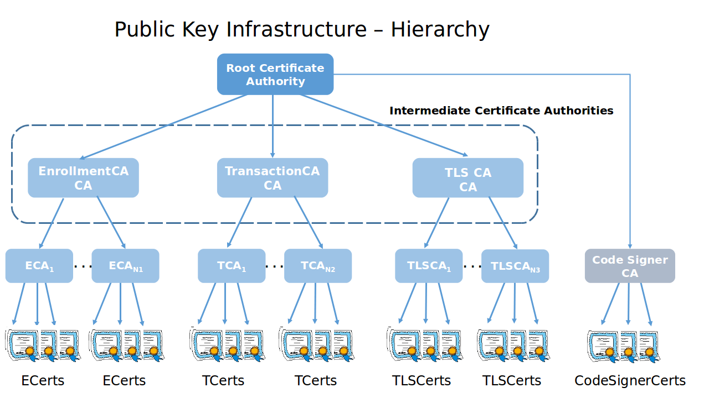
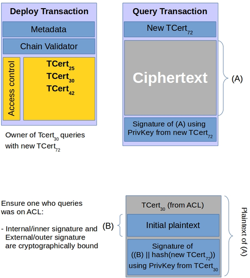
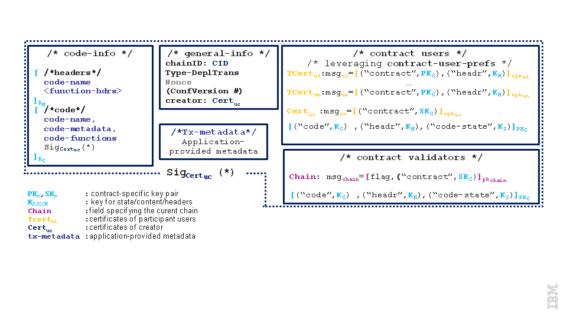
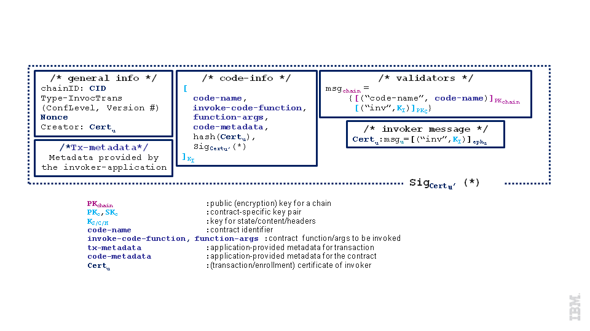
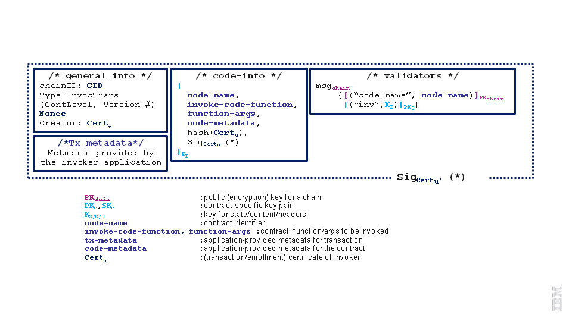
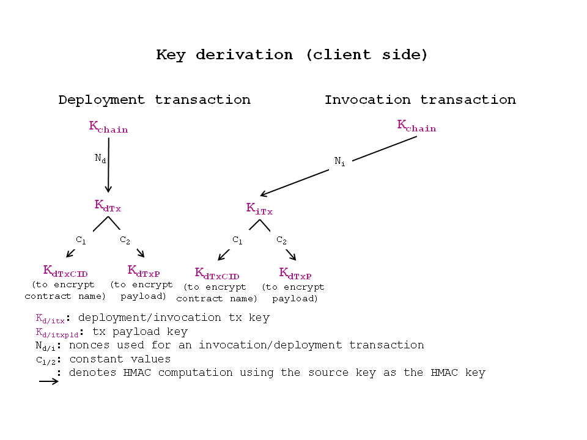
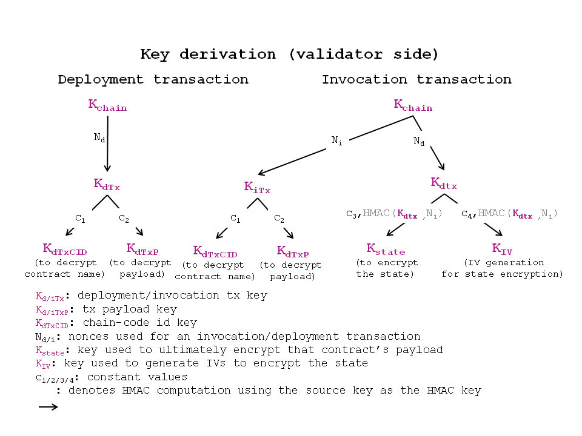
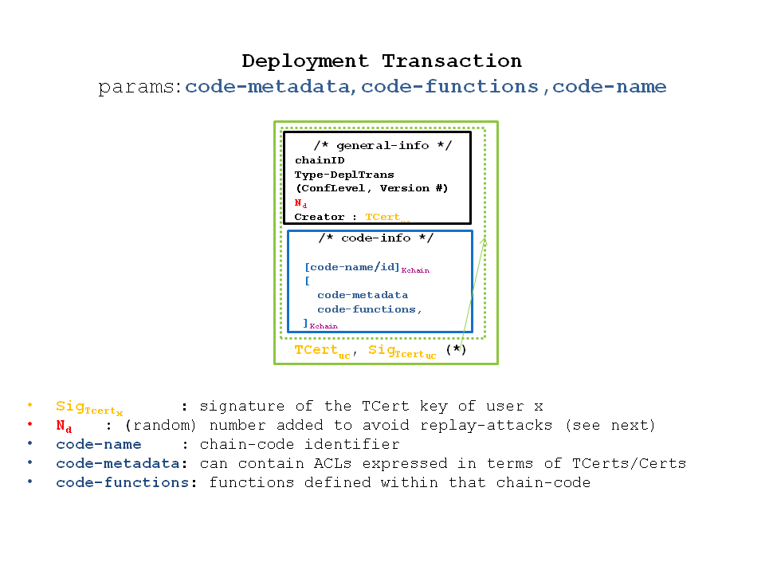
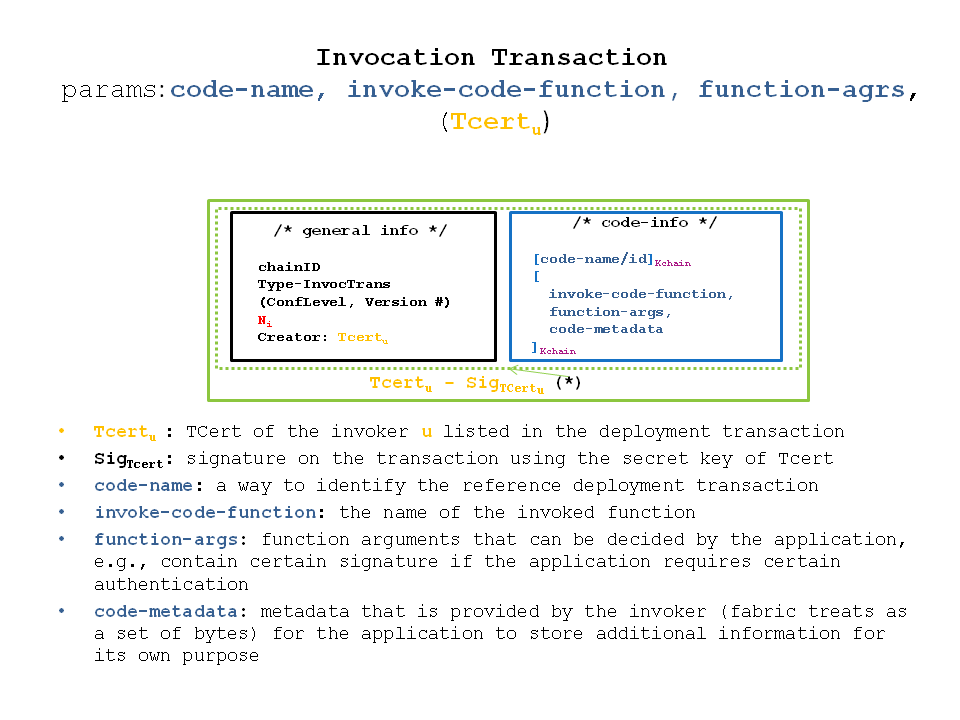

# Security Specification

#### 4. Security
   - 4. Security
   - 4.1 Business security requirements
   - 4.2 User Privacy through Membership Services
   - 4.2.1 User/Client Enrollment Process
   - 4.2.2 Expiration and revocation of certificates
   - 4.2.3 Online wallet service
   - 4.3 Transaction security offerings at the infrastructure level
   - 4.3.1 Security lifecycle of transactions
   - 4.3.2 Transaction confidentiality
   - 4.3.2.1 Confidentiality against users
   - 4.3.2.2 Confidentiality against validators
   - 4.3.3 Invocation access control
   - 4.3.4 Replay attack resistance
   - 4.4 Access control features on the application
   - 4.4.1 Invocation access control
   - 4.4.2 Read access control
   - 4.5 Online wallet service
   - 4.6 Network security (TLS)
   - 4.7 Restrictions in the current release
   - 4.7.1 Simplified client
   - 4.7.1 Simplified transaction confidentiality

## 4. Security

This section discusses the setting depicted in the figure below.
In particular, the system consists of the following entities:
membership management infrastructure, i.e., a set of entities that are
responsible for identifying an individual user (using any form of identification
considered in the system, e.g., credit cards, id-cards), open an account for
that user to be able to register, and issue the necessary credentials to
successfully create transactions and deploy or invoke chaincode successfully
through the fabric.

 * Peers, that are classified as validating peers, and non-validating peers.
   Validating peers (also known as validators) order and process (check validity, execute,
   and add to the blockchain) user-messages (transactions) submitted to the network.
   Non validating peers (also known as peers) receive user transactions on behalf of users,
   and after some fundamental validity checks, they forward the transactions to their
   neighboring validating peers. Peers maintain an up-to-date copy of the blockchain,
   but in contradiction to validators, they do not execute transactions
   (a process also known as *transaction validation*).
 * End users of the system, that have registered to our membership service administration,
   after having demonstrated ownership of what is considered *identity* in the system,
   and have obtained credentials to install the client-software and submit transactions
   to the system.
 * Client-software, the software that needs to be installed at the client side for the
   latter to be able to complete his registration to our membership service and submit
   transactions to the system.
 * Online wallets, entities that are trusted by a user to maintain that user's credentials,
   and submit transactions solely upon user request to the network. Online wallets come
   with their own software at the client-side, that is usually light-weight, as the
   client only needs to authenticate himself and his requests to the wallet.
   While it can be the case that peers can play the role of *online wallet* for a set of
   users, in the following sessions the security of online wallets is detailed separately.

Users who wish to make use of the fabric, open an account at the membership management
administration, by proving ownership of identity as discussed in previous sections, new chaincodes
are announced to the blockchain network by the chaincode creator (developer) through the means
of a deployment transaction that the client-software would construct on behalf of the developer.
Such transaction is first received by a peer or validator, and afterwards circulated
in the entire network of validators, this transaction is executed and finds its place to
the blockchain network. Users can also invoke a function of an already deployed chaincode
through an invocation transaction.

The next section provides a summary of the business goals of the system that drive the security requirements. 
We then overview the security components and their operation and show how this design fulfills the security requirements.  

### 4.1 Business security requirements
This section presents business security requirements that are relevant to the context of the fabric.
**Incorporation of identity and role management.**

In order to adequately support real business applications it is necessary to progress beyond ensuring cryptographic continuity. 
A workable B2B system must consequently move towards addressing proven/demonstrated identities or other attributes relevant to 
conducting business. Business transactions and consumer interactions with financial institutions need to be unambiguously mapped 
to account holders. Business contracts typically require demonstrable affiliation with specific institutions and/or possession 
of other specific properties of transacting parties. Accountability and non-frameability are two reasons that identity management 
is a critical component of such systems.

Accountability means that users of the system, individuals, or corporations, who misbehave can be traced back and be set accountable 
for their actions. In many cases, members of a B2B system are required to use their identities (in some form) to participate in the 
system, in a way such that accountability is guaranteed. Accountability and non-frameability are both essential security requirements 
in B2B systems and they are closely related. That is, a B2B system should guarantee that an honest user of such system cannot be 
framed to be accused as responsible for transactions originated by other users.

In addition a B2B system should be renewable and flexible in order to accommodate changes of participants’s roles and/or affiliations.

**Transactional privacy.**

In B2B relationships there is a strong need for transactional privacy, i.e., allowing the end-user of a system to control the degree 
to which it interacts and shares information with its environment. For example, a corporation doing business through a transactional 
B2B system requires that its transactions are not visible to other corporations or industrial partners that are not authorized to 
share classified information with.


Transactional privacy in the fabric is offered by the mechanisms to achieve two properties with respect to non authorized users:

* Transaction anonymity, where the owner of a transaction is hidden among the so called *anonymity set*, which in the fabric, is the 
set of users.

* Transaction unlinkability, where two or more transactions of the same user should not be linked as such.

Clearly depending on the context, non-authorized users can be anyone outside the system, or a subset of users.

Transactional privacy is strongly associated to the confidentiality of the content of a contractual agreement between two or more 
members of a B2B system, as well as to the anonymity and unlinkability of any authentication mechanism that should be in place within 
transactions.

**Reconciling transactional privacy with identity management.**

As described later in this document, the approach taken here to reconcile identity management with user privacy and to enable competitive institutions to transact effectively on a common blockchain (for both intra- and inter-institutional transactions) is as follows:

1. add certificates to transactions to implement a “permissioned” blockchain

2. utilize a two-level system:

   1. (relatively) static enrollment certificates (ECerts), acquired via registration with an enrollment certificate authority (CA).

   2. transaction certificates (TCerts) that faithfully but pseudonymously represent enrolled users, acquired via a transaction CA.

3. offer mechanisms to conceal the content of transactions to unauthorized members of the system.

**Audit support.** Commercial systems are occasionally subjected to audits. Auditors in such cases should be given the means to check a certain transaction, or a certain group of transactions, the activity of a particular user of the system, or the operation of the system itself. Thus, such capabilities should be offered by any system featuring transactions containing contractual agreements between business partners.

### 4.2 User Privacy through Membership Services

Membership Services consists of an infrastructure of several entities that together manage the identity and privacy of users on the network. These services validate user’s identity, register the user in the system, and provide all the credentials needed for him/her to be an active and compliant participant able to create and/or invoke transactions. A Public Key Infrastructure (PKI) is a framework based on public key cryptography that ensures not only the secure exchange of data over public networks but also affirms the identity of the other party. A PKI manages the generation, distribution and revocation of keys and digital certificates. Digital certificates are used to establish user credentials and to sign messages. Signing messages with a certificate ensures that the message has not been altered. Typically a PKI has a Certificate Authority (CA), a Registration Authority (RA), a certificate database, and a certificate storage. The RA is a trusted party that authenticates users and vets the legitimacy of data, certificates or other evidence submitted to support the user’s request for one or more certificates that reflect that user’s identity or other properties. A CA, upon advice from an RA, issues digital certificates for specific uses and is certified directly or hierarchically by a root CA. Alternatively, the user-facing communications and due diligence responsibilities of the RA can be subsumed as part of the CA. Membership Services is composed of the entities shown in the following figure. Introduction of such full PKI reinforces the strength of this system for B2B (over, e.g. Bitcoin).



*Root Certificate Authority (Root CA):* entity that represents the trust anchor for the PKI scheme. Digital certificates verification follows a chain of trust. The Root CA is the top-most CA in the PKI hierarchy.

*Registration Authority (RA):* a trusted entity that can ascertain the validity and identity of users who want to participate in the permissioned blockchain. It is responsible for out-of-band communication with the user to validate his/her identity and role.  It creates registration credentials needed for enrollment and information on root of trust.

*Enrollment Certificate Authority (ECA):*  responsible for issuing Enrollment Certificates (ECerts) after validating the registration credentials provided by the user.

*Transaction Certificate Authority (TCA):* responsible for issuing Transaction Certificates (TCerts) after validating the enrollment credentials provided by the user.  

*TLS Certificate Authority (TLS-CA):* responsible for issuing TLS certificates and credentials that allow the user to make use of its network. It validates the credential(s) or evidence provided by the user that justifies issuance of a TLS certificate that includes specific information pertaining to the user.

In this specification, membership services is expressed through the following associated certificates issued by the PKI:

*Enrollment Certificates (ECerts)*
ECerts are long-term certificates. They are issued for all roles, i.e. users, non-validating peers, and validating peers. In the case of users, who submit transactions for candidate incorporation into the blockchain and who also own TCerts (discussed below), there are two possible structure and usage models for ECerts:

 * Model A:  ECerts contain the identity/enrollmentID of their owner and can be used to offer only nominal entity-authentication for TCert requests and/or within transactions. They contain the public part of two key pairs – a signature key-pair and an encryption/key agreement key-pair. ECerts are accessible to everyone.

 * Model B: ECerts contain the identity/enrollmentID of their owner and can be used to offer only nominal entity-authentication for TCert requests. They contain the public part of a signature key-pair, i.e., a signature verification public key. ECerts are preferably accessible to only TCA and auditors, as relying parties. They are invisible to transactions, and thus (unlike TCerts) their signature key pairs do not play a non-repudiation role at that level.

*Transaction Certificates (TCerts)*
TCerts are short-term certificates for each transaction. They are issued by the TCA upon authenticated user-request. They securely authorize a transaction and may be configured to not reveal the identities of who is involved in the transaction or to selectively reveal such identity/enrollmentID information. They include the public part of a signature key-pair, and may be configured to also include the public part of a key agreement key pair. They are issued only to users. They are uniquely associated to the owner – they may be configured so that this association is known only by the TCA (and to authorized auditors). TCerts may be configured to not carry information of the identity of the user. They enable the user not only to anonymously participate in the system but also prevent linkability of transactions.

However, auditability and accountability requirements assume that the TCA is able to retrieve TCerts of a given identity, or retrieve the owner of a specific TCert. For details on how TCerts are used in deployment and invocation transactions see Section 4.3, Transaction Security offerings at the infrastructure level.  

TCerts can accommodate encryption or key agreement public keys (as well as digital signature verification public keys).
If TCerts are thus equipped, then enrollment certificates need not also contain encryption or key agreement public keys.

Such a key agreement public key, Key_Agreement_TCertPub_Key, can be generated by the transaction certificate authority (TCA) using a method that is the same as that used to generate the Signature_Verification_TCertPub_Key, but using an index value of TCertIndex + 1 rather than TCertIndex, where TCertIndex is hidden within the TCert by the TCA for recovery by the TCert owner.

The structure of a Transaction Certificate (TCert) is as follows:
* TCertID – transaction certificate ID (preferably generated by TCA randomly in order to avoid unintended linkability via the Hidden Enrollment ID field).
* Hidden Enrollment ID: AES_Encrypt<sub>K</sub>(enrollmentID), where key K = [HMAC(Pre-K, TCertID)]<sub>256-bit truncation</sub> and where three distinct key distribution scenarios for Pre-K are defined below as (a), (b) and (c).
* Hidden Private Keys Extraction: AES_Encrypt<sub>TCertOwner_EncryptKey</sub>(TCertIndex || known padding/parity check vector) where || denotes concatenation, and where each batch has a unique (per batch) time-stamp/random offset that is added to a counter (initialized at 1 in this implementation) in order to generate TCertIndex. The counter can be incremented by 2 each time in order to accommodate generation by the TCA of the public keys and recovery by the TCert owner of the private keys of both types, i.e., signature key pairs and key agreement key pairs.
* Sign Verification Public Key – TCert signature verification public key.
* Key Agreement Public Key – TCert key agreement public key.
* Validity period – the time window during which the transaction certificate can be used for the outer/external signature of a transaction.

There are at least three useful ways to consider configuring the key distribution scenario for the Hidden Enrollment ID field:
*(a)* Pre-K is distributed during enrollment to user clients, peers and auditors, and is available to the TCA and authorized auditors. It may, for example, be derived from K<sub>chain</sub> (described subsequently in this specification) or be independent of key(s) used for chaincode confidentiality.

*(b)* Pre-K is available to validators, the TCA and authorized auditors. K is made available by a validator to a user (under TLS) in response to a successful query transaction. The query transaction can have the same format as the invocation transaction. Corresponding to Example 1 below, the querying user would learn the enrollmentID of the user who created the Deployment Transaction if the querying user owns one of the TCerts in the ACL of the Deployment Transaction. Corresponding to Example 2 below, the querying user would learn the enrollmentID of the user who created the Deployment Transaction if the enrollmentID of the TCert used to query matches one of the affiliations/roles in the Access Control field of the Deployment Transaction.

*Example 1:*



*Example 2:*


*(c)* Pre-K is available to the TCA and authorized auditors. The TCert-specific K can be distributed the TCert owner (under TLS) along with the TCert, for each TCert in the batch. This enables targeted release by the TCert owner of K (and thus trusted notification of the TCert owner’s enrollmentID). Such targeted release can use key agreement public keys of the intended recipients and/or PK<sub>chain</sub> where SK<sub>chain</sub> is available to validators as described subsequently in this specification. Such targeted release to other contract participants can be incorporated into a transaction or done out-of-band.

If the TCerts are used in conjunction with ECert Model A above, then using (c) where K is not distributed to the TCert owner may suffice.
If the TCerts are used in conjunction with ECert Model A above, then the Key Agreement Public Key field of the TCert may not be necessary.

The Transaction Certificate Authority (TCA) returns TCerts in batches, each batch contains the KeyDF_Key (Key-Derivation-Function Key) which is not included within every TCert but delivered to the client with the batch of TCerts (using TLS). The KeyDF_Key allows the TCert owner to derive TCertOwner_EncryptKey which in turn enables recovery of TCertIndex from AES_Encrypt<sub>TCertOwner_EncryptKey</sub>(TCertIndex || known padding/parity check vector).

*TLS-Certificates (TLS-Certs)*
TLS-Certs are certificates used for system/component-to-system/component communications. They carry the identity of their owner and are used for network level security.

This implementation of membership services provides the following basic functionality: there is no expiration/revocation of ECerts; expiration of TCerts is provided via the validity period time window; there is no revocation of TCerts. The ECA, TCA, and TLS CA certificates are self-signed, where the TLS CA is provisioned as a trust anchor.

#### 4.2.1 User/Client Enrollment Process

The next figure has a high-level description of the user enrollment process. It has an offline and an online phase.


*Offline Process:* in Step 1, each user/non-validating peer/validating peer has to present strong identification credentials (proof of ID) to a Registration Authority (RA) offline. This has to be done out-of-band to provide the evidence needed by the RA to create (and store) an account for the user. In Step 2, the RA returns the associated username/password and trust anchor (TLS-CA Cert in this implementation) to the user. If the user has access to a local client then this is one way the client can be securely provisioned with the TLS-CA certificate as trust anchor.

*Online Phase:* In Step 3, the user connects to the client to request to be enrolled in the system. The user sends his username and password to the client. On behalf of the user, the client sends the request to the PKI framework, Step 4, and receives a package, Step 5, containing several certificates, some of which should correspond to private/secret keys held by the client. Once the client verifies that the all the crypto material in the package is correct/valid, it stores the certificates in local storage and notifies the user. At this point the user enrollment has been completed.


Figure 4 shows a detailed description of the enrollment process. The PKI framework has the following entities – RA, ECA, TCA and TLS-CA. After Step 1, the RA calls the function “AddEntry” to enter the (username/password) in its database. At this point the user has been formally registered into the system database. The client needs the TLS-CA certificate (as trust anchor) to verify that the TLS handshake is set up appropriately with the server. In Step 4, the client sends the registration request to the ECA along with its enrollment public key and additional identity information such as username and password (under the TLS record layer protocol). The ECA verifies that such user really exists in the database. Once it establishes this assurance the user has the right to submit his/her enrollment public key and the ECA will certify it. This enrollment information is of a one-time use. The ECA updates the database marking that this registration request information (username/password) cannot be used again. The ECA constructs, signs and sends back to the client an enrollment certificate (ECert) that contains the user’s enrollment public key (Step 5). It also sends the ECA Certificate (ECA-Cert) needed in future steps (client will need to prove to the TCA that his/her ECert was created by the proper ECA). (Although the ECA-Cert is self-signed in the initial implementation, the TCA and TLS-CA and ECA are co-located.) The client verifies, in Step 6, that the public key inside the ECert is the one originally submitted by the client (i.e. that the ECA is not cheating). It also verifies that all the expected information within the ECert is present and properly formed.

Similarly, In Step 7, the client sends a registration request to the TLS-CA along with its public key and identity information. The TLS-CA verifies that such user is in the database. The TLS-CA generates, and signs a TLS-Cert that contains the user’s TLS public key (Step 8). TLS-CA sends the TLS-Cert and its certificate (TLS-CA Cert). Step 9 is analogous to Step 6, the client verifies that the public key inside the TLS Cert is the one originally submitted by the client and that the information in the TLS Cert is complete and properly formed. In Step 10, the client saves all certificates in local storage for both certificates. At this point the user enrollment has been completed.

In this implementation the enrollment process for validators is the same as that for peers. However, it is possible that a different implementation would have validators enroll directly through an on-line process.


*Client:* Request for TCerts batch needs to include (in addition to count), ECert and signature of request using ECert private key (where Ecert private key is pulled from Local Storage).

*TCA generates TCerts for batch:* Generates key derivation function key, KeyDF_Key, as HMAC(TCA_KDF_Key, EnrollPub_Key). Generates each TCert public key (using TCertPub_Key = EnrollPub_Key + ExpansionValue G, where 384-bit ExpansionValue = HMAC(Expansion_Key, TCertIndex) and 384-bit Expansion_Key = HMAC(KeyDF_Key, “2”)). Generates each AES_Encrypt<sub>TCertOwner_EncryptKey</sub>(TCertIndex || known padding/parity check vector), where || denotes concatenation and where TCertOwner_EncryptKey is derived as [HMAC(KeyDF_Key, “1”)]<sub>256-bit truncation</sub>.

*Client:* Deriving TCert private key from a TCert in order to be able to deploy or invoke or query: KeyDF_Key and ECert private key need to be pulled from Local Storage. KeyDF_Key is used to derive TCertOwner_EncryptKey as [HMAC(KeyDF_Key, “1”)]<sub>256-bit truncation</sub>; then TCertOwner_EncryptKey is used to decrypt the TCert field AES_Encrypt<sub>TCertOwner_EncryptKey</sub>(TCertIndex || known padding/parity check vector); then TCertIndex is used to derive TCert private key: TCertPriv_Key = (EnrollPriv_Key + ExpansionValue) modulo n, where 384-bit ExpansionValue = HMAC(Expansion_Key, TCertIndex) and 384-bit Expansion_Key = HMAC(KeyDF_Key, “2”).

#### 4.2.2 Expiration and revocation of certificates

It is practical to support expiration of transaction certificates. The time window during which a transaction certificate can be used is expressed by a ‘validity period’ field. The challenge regarding support of expiration lies in the distributed nature of the system. That is, all validating entities must share the same information; i.e. be consistent with respect to the expiration of the validity period associated with the transactions to be executed and validated. To guarantee that the expiration of validity periods is done in a consistent manner across all validators, the concept of validity period identifier is introduced. This identifier acts as a logical clock enabling the system to uniquely identify a validity period. At genesis time the “current validity period” of the chain gets initialized by the TCA. It is essential that this validity period identifier is given monotonically increasing values over time, such that it imposes a total order among validity periods.

A special type of transactions, system transactions, and the validity period identified are used together to announce the expiration of a validity period to the Blockchain. System transactions refer to contracts that have been defined in the genesis block and are part of the infrastructure. The validity period identified is updated periodically by the TCA invoking a system chaincode. Note that only the TCA should be allowed to update the validity period. The TCA sets the validity period for each transaction certificate by setting the appropriate integer values in the following two fields that define a range: ‘not-before’ and ‘not-after’ fields.

TCert Expiration:
At the time of processing a TCert, validators read from the state table associated with the ledger the value of ‘current validity period’ to check if the outer certificate associated with the transaction being evaluated is currently valid. That is, the current value in the state table has to be within the range defined by TCert sub-fields ‘not-before’ and ‘not-after’. If this is the case, the validator continues processing the transaction. In the case that the current value is not within range, the TCert has expired or is not yet valid and the validator should stop processing the transaction.

ECert Expiration:
Enrollment certificates have different validity period length(s) than those in transaction certificates.

Revocation is supported in the form of Certificate Revocation Lists (CRLs). CRLs identify revoked certificates. Changes to the CRLs, incremental differences, are announced through the Blockchain.

### 4.3 Transaction security offerings at the infrastructure level

Transactions in the fabric are user-messages submitted to be included
in the ledger. As discussed in previous sections, these messages have a
specific structure, and enable users to deploy new chaincodes, invoke existing
chaincodes, or query the state of existing chaincodes.
Therefore, the way transactions are formed, announced and processed plays
an important role to the privacy and security offerings of the entire system.

On one hand our membership service provides the means to authenticate transactions as
having originated by valid users of the system, to disassociate transactions with user identities,
but while efficiently tracing the transactions a particular individual under certain conditions
(law enforcement, auditing). In other words, membership services offer to transactions authentication
mechanisms that marry user-privacy with accountability and non-repudiation.

On the other hand, membership services alone cannot offer full privacy of user-activities within
the fabric. First of all, for privacy provisions offered by the fabric to be complete,
privacy-preserving authentication mechanisms need to be accompanied by transaction confidentiality.
This becomes clear if one considers that the content of a chaincode, may leak information on who may have
created it, and thus break the privacy of that chaincode's creator. The first subsection
discusses transaction confidentiality.

<!-- @Binh, @Frank: PLEASE REVIEW THIS PARAGRAPH -->
<!-- Edited by joshhus ... April 6, 2016 -->
Enforcing access control for the invocation of chaincode is an important security requirement.
The fabric exposes to the application (e.g., chaincode creator) the means for the application
to perform its own invocation access control, while leveraging the fabric's membership services.
Section 4.4 elaborates on this.

<!--Enforcing access control on the invocation of chaincodes is another requirement associated
to the security of chaincodes. Though for this one can leverage authentication mechanisms
of membership services, one would need to design invocation ACLs and perform their
validation in a way that non-authorized parties cannot link multiple invocations of
the same chaincode by the same user. Subection 5.2.2 elaborates on this.-->

Replay attacks is another crucial aspect of the security of the chaincode,
as a malicious user may copy a transaction that was added to the Blockchain
in the past, and replay it in the network to distort its operation.
This is the topic of Section 4.3.3.

The rest of this Section presents an overview of how security mechanisms in the
infrastructure are incorporated in the transactions' lifecycle,
and details each security mechanism separately.


#### 4.3.1 Security Lifecycle of Transactions
Transactions are created on the client side. The client can be either plain
client, or a more specialized application, i.e., piece of
software that handles (server) or invokes (client) specific chaincodes
through the blockchain. Such applications are built on top of the
platform (client) and are detailed in Section 4.4.

Developers of new chaincodes create a new deploy transaction by passing to
the fabric infrastructure:
* the confidentiality/security version or type they want the transaction to conform with,
* the set of users who wish to be given access to parts of the chaincode and
  a proper representation of their (read) access rights
<!-- (read-access code/state/activity, invocation-access) -->
* the chaincode specification,
* code metadata, containing information that should be passed to the chaincode
  at the time of its execution
  (e.g., configuration parameters), and
* transaction metadata, that is attached to the transaction structure,
  and is only used by the application that deployed the chaincode.

Invoke and query transactions corresponding to chaincodes with confidentiality
restrictions are created using a similar approach. The transactor provides the
identifier of the chaincode to be executed, the name of the function to be
invoked and its arguments. Optionally, the invoker can pass to the
transaction creation function, code invocation metadata, that will be provided
to the chaincode at the time of its execution. Transaction metadata is another
field that the application of the invoker or the invoker himself can leverage
for their own purposes.

Finally transactions at the client side, are signed by a certificate of their
creator and released to the network of validators.
Validators receive the confidential transactions, and pass them through the following phases:
* *pre-validation* phase, where validators validate the transaction certificate against the accepted root certificate authority,
  verify transaction certificate signature included in the transaction (statically), and check whether the transaction is a replay (see, later section for details on replay attack protection).
* *consensus* phase, where the validators add this transaction to the total order of transactions (ultimately included in the ledger)
* *pre-execution* phase, where validators verify the validity of the transaction / enrollment certificate against the current validity period,
  decrypt the transaction (if the transaction is encrypted), and check that the transaction's plaintext is correctly formed(e.g., invocation access control is respected, included TCerts are correctly formed);
  mini replay-attack check is also performed here within the transactions of the currently processed block.
* *execution* phase, where the (decrypted) chaincode is passed to a container, along with the associated code metadata, and is executed
* *commit* phase, where (encrypted) updates of that chaincodes state is committed to the ledger with the transaction itself.


#### 4.3.2 Transaction confidentiality

Transaction confidentiality requires that under the request of the developer, the plain-text
of a chaincode, i.e., code, description, is not accessible or inferable (assuming a computational
attacker) by any unauthorized entities(i.e., user or peer not authorized by the developer).
For the latter, it is important that for chaincodes with confidentiality requirements the
content of both *deploy* and *invoke* transactions remains concealed. In the same spirit,
non-authorized parties, should not be able to associate invocations (invoke transactions) of a
chaincode to the chaincode itself (deploy transaction) or these invocations to each other.

Additional requirements for any candidate solution is that it respects and supports the privacy
and security provisions of the underlying membership service. In addition, it should not prevent
the enforcement of any invocation access control of the chaincode functions in the fabric, or
the implementation of enforcement of access-control mechanisms on the application (See Subsection 4.4).

In the following is provided the specification of transaction confidentiality
mechanisms at the granularity of users. The last subsection provides some guidelines
on how to extend this functionality at the level of validators.
Information on the features supported in current release and its security
provisions, you can find in Section 4.7.

The goal is to achieve a design that will allow for granting or restricting
access to an entity to any subset of the following parts of a chaincode:
1. chaincode content, i.e., complete (source) code of the
   chaincode,
<!--& roles of users in that chaincode-->
2. chaincode function headers, i.e., the prototypes of the functions included in a chaincode,
<!--access control lists, -->
<!--and their respective list of (anonymous) identifiers of users who should be
   able to invoke each function-->
3. chaincode [invocations &] state, i.e., successive updates to the state of a specific chaincode,
   when one or more functions of its are invoked
4. all the above

Notice, that this design offers the application the capability to leverage the fabric's
membership service infrastructure and its public key infrastructure to build their own access
control policies and enforcement mechanisms.

##### 4.3.2.1 Confidentiality against users

To support fine-grained confidentiality control, i.e., restrict read-access to the
plain-text of a chaincode to a subset of users that the chaincode creator
defines, a chain is bound to a single long-term encryption key-pair
(PK<sub>chain</sub>, SK<sub>chain</sub>).
Though initially this key-pair is to be stored and maintained by each chain's
PKI, in later releases, however, this restriction will be moved away,
as chains (and the associated key-pairs) can be triggered through the Blockchain
by any user with *special* (admin) privileges (See, Section 4.3.2.2).

**Setup**. At enrollment phase, users obtain (as before) an enrollment certificate,
denoted by Cert<sub>u<sub>i</sub></sub> for user u<sub>i</sub>, while each
validator v<sub>j</sub> obtain its enrollment certificate denoted by
Cert<sub>v<sub>j</sub></sub>. Enrollment would grant users and validators the
following credentials:

1. Users:

   a. claim and grant themselves signing key-pair (spk<sub>u</sub>, ssk<sub>u</sub>),

   b. claim and grant themselves encryption key-pair (epk<sub>u</sub>, esk<sub>u</sub>),

   c. obtain the encryption (public) key of the chain PK<sub>chain</sub>

2. Validators:

   a. claim and grant themselves signing key-pair (spk<sub>v</sub>, ssk<sub>v</sub>),

   b. claim and grant themselves an encryption key-pair (epk<sub>v</sub>, esk<sub>v</sub>),

   c. obtain the decryption (secret) key of the chain SK<sub>chain</sub>

Thus, enrollment certificates contain the public part of two key-pairs:
* one signature key-pair [denoted by (spk<sub>v<sub>j</sub></sub>,ssk<sub>v<sub>j</sub></sub>)
  for validators and by (spk<sub>u<sub>i</sub></sub>, ssk<sub>u<sub>i</sub></sub>) for users], and
* an encryption key-pair [denoted by (epk<sub>v<sub>j</sub></sub>,esk<sub>v<sub>j</sub></sub>)
  for validators and (epk<sub>u<sub>i</sub></sub>, esk<sub>u<sub>i</sub></sub>) for users]

Chain, validator and user enrollment public keys are accessible to everyone.

In addition to enrollment certificates, users who wish to anonymously
participate in transactions issue transaction certificates. For simplicity
transaction certificates of a user u<sub>i</sub> are denoted by
TCert<sub>u<sub>i</sub></sub>. Transaction certificates include the public part
of a signature key-pair denoted by  
(tpk<sub>u<sub>i</sub></sub>,tsk<sub>u<sub>i</sub></sub>).

The following section provides a high level description of how transaction
format accommodates read-access restrictions at the granularity of users.

**Structure of deploy transaction.**
The following figure depicts the structure of a typical deploy
transaction with confidentiality enabled.



One can notice that a deployment transaction consists of several sections:
* Section *general-info*: contains the administration details of the
  transaction, i.e., which chain this transaction corresponds to (chained),
  the type of transaction (that is set to ''deplTrans''), the version number of
  confidentiality policy implemented, its creator identifier (expressed by means
  of transaction certificate TCert of enrollment certificate Cert), and a Nonce,
  that facilitates primarily replay-attack resistance techniques.
* Section *code-info*: contains information on the chaincode source code,
  and function headers. As shown in the figure below, there is a symmetric key
  used for the source-code of the chaincode (K<sub>C</sub>), and another
  symmetric key used for the function prototypes (K<sub>H</sub>). A signature of
  the creator of the chaincode is included on the plain-text code such that
  the latter cannot be detached from the transaction and replayed by another
  party.
* Section *chain-validators*: where appropriate key material is passed to the
  validators for the latter to be able to (i) decrypt the chaincode source
  (K<sub>C</sub>), (ii) decrypt the headers,  and
  (iii) encrypt the state when the chaincode has been
  invoked accordingly(K<sub>S</sub>). In particular, the chaincode creator
  generates an encryption key-pair for the chaincode it deploys
  (PK<sub>C</sub>, SK<sub>C</sub>). It then uses PK<sub>C</sub>
  to encrypt all the keys associated to the chaincode:
  <center> [(''code'',K<sub>C</sub>) ,(''headr'',K<sub>H</sub>),(''code-state'',K<sub>S</sub>), Sig<sub>TCert<sub>u<sub>c</sub></sub></sub>(\*)]<sub>PK<sub>c</sub></sub>, </center>
  and passes the secret key SK<sub>C</sub> to the validators using the
  chain-specific public key:
  <center>[(''chaincode'',SK<sub>C</sub>), Sig<sub>TCert<sub>u<sub>c</sub></sub></sub>(*)]<sub>PK<sub>chain</sub></sub>.</center>
* Section *contract-users*: where the public encryption keys of the contract users,
  i.e., users who are given read-access to parts of the chaincode, are used to encrypt
  the keys  associated to their access rights:

  1. SK<sub>c</sub> for the users to be able to read any message associated to
     that chaincode (invocation, state, etc),

  2. K<sub>C</sub> for the user to be able to read only the contract code,

  3. K<sub>H</sub> for the user to only be able to read the headers,

  4. K<sub>S</sub> for the user to be able to read the state associated to that contract.

  Finally users are given the contract's public key PK<sub>c</sub>,
  for them to be able to encrypt information related to that contract for the validators
  (or any in possession of SK<sub>c</sub>) to be able to read it. Transaction certificate
  of each contract user is appended to the transaction and follows that user's message.
  This is done for users to be able to easily search the blockchain
  for transactions they have been part of. Notice that the deployment transaction also
  appends a message to the creator u<sub>c</sub> of the chaincode, for the
  latter to be able to retrieve this transaction through parsing the ledger and without
  keeping any state locally.


The entire transaction is signed by a certificate of the chaincode creator, i.e., enrollment
or transaction certificate as decided by the latter.
Two noteworthy points:
* Messages that are included in a transaction in an encrypted format, i.e., code-functions, code-hdrs,
  are signed before they are encrypted using the same TCert the entire transaction is signed with, or
  even with a different TCert or the ECert of the user (if the transaction deployment should carry the identity
  of its owner. A binding to the underlying transaction carrier should be included in the signed message, e.g.,
  the hash of the TCert the transaction is signed, such that mix\&match attacks are not possible.
  Though we detail such attacks in Section 4.4, in these cases an attacker who sees a transaction should not be able
  to isolate the ciphertext corresponding to, e.g., code-info, and use it for another transaction of her own.
  Clearly, such an ability would disrupt the operation of the system, as a chaincode that was first created by user A,
  will now also belong to malicious user B (who is not even able to read it).
* To offer the ability to the users to cross-verify they are given access to the
  correct key, i.e., to the same key as the other contract users, transaction
  ciphertexts that are encrypted with a key K are accompanied by a commitment
  to K, while the opening of this commitment value is passed to all users who
  are entitled access to K in contract-users, and chain-validator sections.
  <!-- @adecaro: please REVIEW this! -->
  In this way, anyone who is entitled access to that key can verify that the key
  has been properly passed to it. This part is omitted in the figure above to
  avoid confusion.


**Structure of invoke transaction.**
A transaction invoking the chaincode triggering the execution of a function of the chaincode with
user-specified arguments is structured as depicted in the figure below.



Invocation transaction as in the case of deployment transaction consists of a
*general-info* section, a *code-info* section, a section for the *chain-validators*,
and one for the *contract users*, signed altogether with one of the invoker's
transaction certificates.

- General-info follows the same structure as the corresponding section of the
deployment transaction.
The only difference relates to the transaction type that is now set to ''InvocTx'',
and the chaincode identifier or name that is now encrypted under the
chain-specific encryption (public) key.

- Code-info exhibits the same structure as the one of the deployment transaction.
Code payload, as in the case of deployment transaction, consists of function
invocation details (the name of the function invoked, and associated arguments),
code-metadata provided by the application and the transaction's creator
(invoker's u) certificate, TCert<sub>u</sub>. Code payload is signed by the
transaction certificate TCert<sub>u</sub> of the invoker u, as in the case
of deploy transactions. As in the case of
deploy transactions, code-metadata, and tx-metadata, are fields that are
provided by the application and can be used (as described in Section 4.4),
for the latter to implement their own access control mechanisms and roles.

- Finally, contract-users and chain-validator sections provide the key the payload
is encrypted with, the invoker's key, and the chain encryption key respectively.
Upon receiving such transactions, the validators decrypt [code-name]<sub>PK<sub>chain</sub></sub> using the
chain-specific secret key SK<sub>chain</sub> and obtain the invoked chaincode identifier.
Given the latter, validators retrieve from their local storage the chaincode's
decryption key SK<sub>c</sub>, and use it to decrypt chain-validators' message,
that would equip them with the symmetric key K<sub>I</sub> the invocation
transaction's payload was encrypted with.
Given the latter, validators decrypt code-info, and execute the chaincode
function with the specified arguments,
and the code-metadata attached(See, Section 4.4 for more details on the use of
code-metadata). While the chaincode is executed, updates of the state of that
chaincode are possible.
These are encrypted using the state-specific key K<sub>s</sub> that was defined
during that chaincode's deployment. In particular, K<sub>s</sub> is used the
same way K<sub>iTx</sub> is used in the design of our current release
(See, Section 4.7).  

**Structure of query transaction.**
Query transactions have the same format as invoke transactions.
The only difference is that Query transactions do not affect the state
of the chaincode, and thus there is no need for the state to be retrieved
(decrypted) and/or updated (encrypted) after the execution of the chaincode
completes.

##### 4.3.2.2 Confidentiality against validators
This section deals with ways of how to support execution of certain transactions
under a different (or subset) sets of validators in the current chain. This
section inhibits IP restrictions and will be expanded in the following few weeks.


#### 4.3.3 Replay attack resistance
In replay attacks the attacker "replays" a message it "eavesdropped" on the network or ''saw'' on the Blockchain.
Replay attacks are a big problem here, as they can incur into the validating entities re-doing a computationally intensive
process (chaincode invocation) and/or affect the state of the corresponding chaincode, while it requires minimal or no
power from the attacker side.  To make matters worse, if a transaction was a payment transaction, replays could
potentially incur into the payment being performed more than once, without this being the original intention of the payer.
Existing systems resist replay attacks as follows:
* Record hashes of transactions in the system. This solution would require that validators maintain a log of the hash of
  each transaction that has ever been announced through the network, and compare a new transaction against their locally
  stored transaction record. Clearly such approach cannot scale for large networks, and could easily result into validators
  spending a lot of time to do the check of whether a transaction has been replayed, than executing the actual transaction.
* Leverage state that is maintained per user identity (Ethereum). Ethereum keeps some state, e.g., counter (initially set to 1)
  for each identity/pseudonym in the system. Users also maintain their own counter (initially set to 0) for each
  identity/pseudonym of theirs. Each time a user sends a transaction using an identity/pseudonym of his, he increases
  his local counter by one and adds the resulting value to the transaction. The transaction is subsequently signed by that
  user identity and released to the network. When picking up this transaction, validators check the counter value included
  within and compare it with the one they have stored locally; if the value is the same, they increase the local value of
  that identity's counter and accept the transaction. Otherwise, they reject the transaction as invalid or replay.  
  Although this would work well in cases where we have limited number of user identities/pseudonyms (e.g., not too large),
  it would ultimately not scale in a system where users use a different identifier (transaction certificate) per transaction,
  and thus have a number of user pseudonyms proportional to the number of transactions.

Other asset management systems, e.g., Bitcoin, though not directly dealing with replay attacks, they resist them. In systems
that manage (digital) assets, state is maintained on a per asset basis, i.e., validators only keep a record of who owns what.
Resistance to replay attacks come as a direct result from this, as replays of transactions would be immediately be
deemed as invalid by the protocol (since can only be shown to be derived from older owners of an asset/coin). While this would
be appropriate for asset management systems, this does not abide with the needs of a Blockchain systems with more generic
use than asset management.

In the fabric, replay attack protection uses a hybrid approach.
That is, users add in the transaction a nonce that is generated in a different manner
depending on whether the transaction is anonymous (followed and signed by a transaction certificate) or not
(followed and signed by a long term enrollment certificate). More specifically:

* Users submitting a transaction with their enrollment certificate should include in that
  transaction a nonce that is a function of the nonce they used in the previous transaction
  they issued with the same certificate (e.g., a counter function or a hash). The nonce included
  in the first transaction of each enrollment certificate can be either pre-fixed by the system
  (e.g., included in the genesis block) or chosen by the user. In the first case, the genesis block
  would need to include nonceall , i.e., a fixed number and the nonce used by user with identity
  IDA for his first enrollment certificate signed transaction would be
  <center>nonce<sub>round<sub>0</sub>IDA</sub> <- hash(IDA, nonce<sub>all</sub>),</center>
  where IDA appears in the enrollment certificate. From that point onward successive transactions of
  that user with enrollment certificate would include a nonce as follows
  <center>nonce<sub>round<sub>i</sub>IDA</sub> <- hash(nonce<sub>round<sub>{i-1}</sub>IDA</sub>),</center>
  that is the nonce of the ith transaction would be using the hash of the nonce used in the {i-1}th transaction of that certificate.
  Validators here continue to process a transaction they receive, as long as it satisfies the condition mentioned above.
  Upon successful validation of transaction's format, the validators update their database with that nonce.

  **Storage overhead**:

  1. on the user side: only the most recently used nonce,

  2. on validator side: O(n), where n is the number of users.
* Users submitting a transaction with a transaction certificate
  should include in the transaction a random nonce, that would guarantee that
  two transactions do not result into the same hash. Validators add the hash of
  this transaction in their local database if the transaction certificate used within
  it has not expired. To avoid storing large amounts of hashes, validity periods of transaction certificates
  are leveraged. In particular validators maintain an updated record of received
  transactions' hashes within the current or future validity period.

  **Storage overhead** (only makes sense for validators here):  O(m), where m is the approximate number of
  transactions within a validity period and corresponding validity period identifier (see below).

### 4.4 Access control features on the application

An application, is a piece of software that runs on top of a Blockchain client software, and,
performs a special task over the Blockchain, i.e., restaurant table reservation.
Application software have a version of
developer, enabling the latter to generate and manage a couple of chaincodes that are necessary for
the business this application serves, and a client-version that would allow the application's end-users
to make use of the application, by invoking these chaincodes.
The use of the Blockchain can be transparent to the application end-users or not.

This section describes how an application leveraging chaincodes can implement its own access control policies,
and guidelines on how our Membership services PKI can be leveraged for the same purpose.

The presentation is divided into enforcement of invocation access control,
and enforcement of read-access control by the application.


#### 4.4.1 Invocation access control
To allow the application to implement its own invocation access control at the
application layer securely, special support by the fabric must be provided.
In the following we elaborate on the tools exposed by the fabric to the
application for this purpose, and provide guidelines on how these should be used
by the application for the latter to enforce access control securely.


**Support from the infrastructure.**
For the chaincode creator, let it be, *u<sub>c</sub>*,
to be able to implement its own invocation access control at
the application layer securely, special support by the fabric must be provided.
More specifically fabric layer gives access to following capabilities:

1. The client-application can request the fabric to sign and verify any message with specific transaction certificates or enrollment certificate the client owns; this is expressed via the Certificate Handler interface

2. The client-application can request the fabric a unique *binding* to be used to bind authentication data of the application to the underlying transaction transporting it; this is expressed via the Transaction Handler interface

3. Support for a transaction format, that allows for the application to specify metadata, that are passed to the chaincode at deployment, and invocation time; the latter denoted by code-metadata.


The **Certificate Handler** interface allows to sign and verify any message using signing key-pair underlying the associated certificate.
The certificate can be a TCert or an ECert.

```
// CertificateHandler exposes methods to deal with an ECert/TCert
type CertificateHandler interface {

    // GetCertificate returns the certificate's DER
    GetCertificate() []byte

    // Sign signs msg using the signing key corresponding to the certificate
    Sign(msg []byte) ([]byte, error)

    // Verify verifies msg using the verifying key corresponding to the certificate
    Verify(signature []byte, msg []byte) error

    // GetTransactionHandler returns a new transaction handler relative to this certificate
    GetTransactionHandler() (TransactionHandler, error)
}
```


The **Transaction Handler** interface allows to create transactions and give access to the underlying *binding* that can be leveraged to link
application data to the underlying transaction. Bindings are a concept that have been introduced in network transport protocols (See, https://tools.ietf.org/html/rfc5056),
known as *channel bindings*, that *allows applications to establish that the two end-points of a secure channel at one network layer are the same as at a higher layer
by binding authentication at the higher layer to the channel at the lower layer.
This allows applications to delegate session protection to lower layers, which has various performance benefits.*
Transaction bindings offer the ability to uniquely identify the fabric layer of the transaction that serves as the container that
application data uses to be added to the ledger.

```
// TransactionHandler represents a single transaction that can be uniquely determined or identified by the output of the GetBinding method.
// This transaction is linked to a single Certificate (TCert or ECert).
type TransactionHandler interface {

    // GetCertificateHandler returns the certificate handler relative to the certificate mapped to this transaction
    GetCertificateHandler() (CertificateHandler, error)

    // GetBinding returns a binding to the underlying transaction (container)
    GetBinding() ([]byte, error)

    // NewChaincodeDeployTransaction is used to deploy chaincode
    NewChaincodeDeployTransaction(chaincodeDeploymentSpec *obc.ChaincodeDeploymentSpec, uuid string) (*obc.Transaction, error)

    // NewChaincodeExecute is used to execute chaincode's functions
    NewChaincodeExecute(chaincodeInvocation *obc.ChaincodeInvocationSpec, uuid string) (*obc.Transaction, error)

    // NewChaincodeQuery is used to query chaincode's functions
    NewChaincodeQuery(chaincodeInvocation *obc.ChaincodeInvocationSpec, uuid string) (*obc.Transaction, error)
}
```
For version 1, *binding* consists of the *hash*(TCert, Nonce), where TCert, is the transaction certificate
used to sign the entire transaction, while Nonce, is the nonce number used within.

The **Client** interface is more generic, and offers a mean to get instances of the previous interfaces.

```
type Client interface {

    ...

    // GetEnrollmentCertHandler returns a CertificateHandler whose certificate is the enrollment certificate
    GetEnrollmentCertificateHandler() (CertificateHandler, error)

    // GetTCertHandlerNext returns a CertificateHandler whose certificate is the next available TCert
    GetTCertificateHandlerNext() (CertificateHandler, error)

    // GetTCertHandlerFromDER returns a CertificateHandler whose certificate is the one passed
    GetTCertificateHandlerFromDER(der []byte) (CertificateHandler, error)

}
```

To support application-level access control lists for controlling chaincode
invocation, the fabric's transaction and chaincode specification format
have an additional field to store application-specific metadata.
This field is depicted in both figures 1, by code-metadata. The content of this field is decided
by the application, at the transaction creation time.
The fabric layer treats it as an unstructured stream of bytes.


```

message ChaincodeSpec {

    ...

    ConfidentialityLevel confidentialityLevel;
    bytes metadata;

    ...
}


message Transaction {
    ...

    bytes payload;
    bytes metadata;

    ...
}
```

To assist chaincode execution, at the chaincode invocation time, the validators provide the
chaincode with additional information, like the metadata and the binding.  

**Application invocation access control.**
This section describes how the application can leverage the means provided by the fabric
to implement its own access control on its chaincode functions.
In the scenario considered here, the following entities are identified:

1. **C**: is a chaincode that contains a single function, e.g., called *hello*;

2. **u<sub>c</sub>**: is the **C** deployer;

3. **u<sub>i</sub>**: is a user who is authorized to invoke **C**'s functions. User u<sub>c</sub> wants to ensure that only u<sub>i</sub> can invoke the function *hello*.

*Deployment of a Chaincode:* At deployment time, u<sub>c</sub> has full control on the deployment transaction's metadata,
 and can be used to store a list of ACLs (one per function), or a list of roles that are needed by the application. The format which is used to store these ACLs is up to the deployer's application, as the chaincode is the one
who would need to parse the metadata at execution time.
To define each of these lists/roles, u<sub>c</sub> can use any TCerts/Certs of the u<sub>i</sub> (or, if applicable, or other users who have been assigned that privilege or role). Let this be TCert<sub>u<sub>i</sub></sub>.
The exchange of TCerts or Certs among the developer and authorized users is done through an out-of-band channel.

Assume that the application of u<sub>c</sub>'s requires that to invoke the *hello* function, a certain message *M* has to be authenticated by an authorized invoker (u<sub>i</sub>, in our example).
One can distinguish the following two cases:

1. *M* is one of the chaincode's function arguments;

2. *M* is the invocation message itself, i.e., function-name, function-arguments.

*Chaincode invocation:*
To invoke C, u<sub>i</sub>'s application needs to sign *M* using the TCert/ECert, that was used to identify u<sub>i</sub>'s participation in the chaincode at the associated
deployment transaction's metadata, i.e., TCert<sub>u<sub>i</sub></sub>. More specifically, u<sub>i</sub>'s client application does the following:

1. Retrieves a CertificateHandler for Cert<sub>u<sub>i</sub></sub>, *cHandler*;

2. obtains a new TransactionHandler to issue the execute transaction, *txHandler* relative to his next available TCert or his ECert;

3. gets *txHandler*'s *binding* by invoking *txHandler.getBinding()*;

4. signs *'*M* || txBinding'* by invoking *cHandler.Sign('*M* || txBinding')*, let *sigma* be the output of the signing function;

5. issues a new execute transaction by invoking, *txHandler.NewChaincodeExecute(...)*. Now, *sigma* can be included in the transaction as one of the arguments that are passed to the function (case 1) or as part of the code-metadata section of the payload(case 2).

*Chaincode processing:*
The validators, who receive the execute transaction issued u<sub>i</sub>, will provide to *hello* the following information:

1. The *binding* of the execute transaction, that can be independently computed at the validator side;

2. The *metadata* of the execute transaction (code-metadata section of the transaction);

3. The *metadata* of the deploy transaction (code-metadata component of the corresponding deployment transaction).

Notice that *sigma* is either part of the arguments of the invoked function, or stored inside the code-metadata of the invocation transaction (properly formatted by the client-application).
Application ACLs are included in the code-metadata section, that is also passed to the chaincode at execution time.
Function *hello* is responsible for checking that *sigma* is indeed a valid signature issued by TCert<sub>u<sub>i</sub></sub>, on '*M* || *txBinding'*.

#### 4.4.2 Read access control
This section describes how the fabric's infrastructure offers support to the application to
enforce its own read-access control policies at the level of users. As in the case of invocation access
control, the first part describes the infrastructure features that can be leveraged by the application for this
purpose, and the last part details on the way applications should use these tools.

For the purpose of this discussion, we leverage a similar example as before, i.e.,

1. **C**: is a chaincode that contains a single function, e.g., called *hello*;

2. **u<sub>A</sub>**: is the **C**'s deployer, also known as application;

3. **u<sub>r</sub>**: is a user who is authorized to read **C**'s functions. User u<sub>A</sub> wants to ensure that only u<sub>r</sub> can read the function *hello*.

**Support from the infrastructure.**
For **u<sub>A</sub>** to be able to implement its own read access control at the application layer securely, our infrastructure is required to
support the transaction format for code deployment and invocation, as depicted in the two figures below.




More specifically fabric layer is required to provide the following functionality:

1. Provide minimal encryption capability such that data is only decryptable by a validator's (infrastructure) side; this means that the infrastructure should move closer to our future version, where an asymmetric encryption scheme is used for encrypting transactions. More specifically, an asymmetric key-pair is used for the chain, denoted by K<sub>chain</sub> in the Figures above, but detailed in Section <a href="./txconf.md">Transaction Confidentiality</a>.

2. The client-application can request the infrastructure sitting on the client-side to encrypt/decrypt information using a specific public encryption key, or that client's long-term decryption key.

3. The transaction format offers the ability to the application to store additional transaction metadata, that can be passed to the client-application after the latter's request. Transaction metadata, as opposed to code-metadata, is not encrypted or provided to the chaincode at execution time. Validators treat these metadata as a list of bytes they are not responsible for checking validity of.

**Application read-access control.**
For this reason the application may request and obtain access to the public encryption key of the user **u<sub>r</sub>**; let that be **PK<sub>u<sub>r</sub></sub>**. Optionally,
**u<sub>r</sub>** may be providing **u<sub>A</sub>** with a certificate of its, that would be leveraged by the application, say, TCert<sub>u<sub>r</sub></sub>; given the latter,
the application would, e.g., be able to trace that user's transactions w.r.t. the application's chaincodes. TCert<sub>u<sub>r</sub></sub>, and PK<sub>u<sub>r</sub></sub>, are
exchanged in an out-of-band channel.

At deployment time, application **u<sub>A</sub>** performs the following steps:

1. Uses the underlying infrastructure to encrypt the information of **C**, the application would like to make accessible to **u<sub>r</sub>**, using PK<sub>u<sub>r</sub></sub>.
   Let C<sub>u<sub>r</sub></sub> be the resulting ciphertext.

2. (optional) C<sub>u<sub>r</sub></sub> can be concatenated with TCert<sub>u<sub>r</sub></sub>

3. Passes the overall string as ''Tx-metadata'' of the confidential transaction to be constructed.

At invocation time, the client-application on u<sub>r</sub>'s node, would be able, by obtaining the deployment transaction to retrieve the content of **C**.
It just needs to retrieve the **tx-metadata** field of the associated deployment transaction, and trigger the decryption functionality offered by our Blockchain
infrastrucure's client, for C<sub>u<sub>r</sub></sub>. Notice that it is the application's responsibility to encrypt the correct **C** for u<sub>r</sub>.
Also, the use of **tx-metadata** field can be generalized to accommodate application-needs. E.g., it can be that invokers leverage the same field of invocation transactions
to pass information to the developer of the application, etc.

<font color="red">**Important Note:** </font> It is essential to note that validators **do not provide** any decryption oracle to the chaincode
throughout its execution. Its infrastructure is though responsible for decrypting the payload of the chaincode itself (as well as
the code-metadata fields near it), and provide those to containers for deployment/execution.

### 4.5 Online wallet service


This section describes the security design of a wallet service, which in this case is a node where end-users can register, move their key material to, and perform transactions through.
Because the wallet service is in possession of the user's key material, it is clear that without a secure authorization
mechanism in place a malicious wallet service could successfully impersonate the user.
We thus emphasize that this design corresponds to a wallet service that is **trusted** to only perform transactions
on behalf of its clients, with the consent of the latter.
There are two cases for the registration of an end-user to an online wallet service:

1. When the user has registered with the registration authority and acquired his/her `<enrollID, enrollPWD>`,
   but has not installed the client to trigger and complete the enrollment process;
2. When the user has already installed the client, and completed the enrollment phase.

Initially, the user interacts with the online wallet service to issue credentials that would allow him to authenticate
to the wallet service. That is, the user is given a username, and password, where username identifies the user in the
membership service, denoted by AccPub, and password is the associated secret, denoted by AccSec, that is **shared** by
both user and service.

To enroll through the online wallet service, a user must provide the following request
object to the wallet service:


    AccountRequest /* account request of u \*/
    {
        OBCSecCtx ,           /* credentials associated to network \*/
        AccPub<sub>u</sub>,   /* account identifier of u \*/
        AccSecProof<sub>u</sub>  /* proof of AccSec<sub>u</sub>\*/
     }

OBCSecCtx refers to user credentials, which depending on the stage of his enrollment process, can be either his enrollment ID and password, `<enrollID, enrollPWD>` or his enrollment certificate and associated secret key(s)
(ECert<sub>u</sub>, sk<sub>u</sub>),  where  sk<sub>u</sub> denotes for simplicity signing and decryption secret of the user.
The content of AccSecProof<sub>u</sub> is an HMAC on the rest fields of request using the shared secret. Nonce-based methods
similar to what we have in the fabric can be used to protect against replays.
OBCSecCtx would give the online wallet service the necessary information to enroll the user or issue required TCerts.

For subsequent requests, the user u should provide to the wallet service a request of similar format.

     TransactionRequest /* account request of u \*/
     {
          TxDetails,			/* specifications for the new transaction \*/
          AccPub<sub>u</sub>,		/* account identifier of u \*/
          AccSecProof<sub>u</sub>	/* proof of AccSec<sub>u</sub> \*/
     }

Here, TxDetails refer to the information needed by the online service to construct a transaction on behalf of the user, i.e.,
the type, and user-specified content of the transaction.

AccSecProof<sub>u</sub> is again an HMAC on the rest fields of request using the shared secret.
Nonce-based methods similar to what we have in the fabric can be used to protect against replays.

TLS connections can be used in each case with server side authentication to secure the request at the
network layer (confidentiality, replay attack protection, etc)


### 4.6 Network security (TLS)
The TLS CA should be capable of issuing TLS certificates to (non-validating) peers, validators, and individual clients (or browsers capable of storing a private key). Preferably, these certificates are distinguished by type, per above. TLS certificates for CAs of the various types (such as TLS CA, ECA, TCA) could be issued by an intermediate CA (i.e., a CA that is subordinate to the root CA). Where there is not a particular traffic analysis issue, any given TLS connection can be mutually authenticated, except for requests to the TLS CA for TLS certificates.

In the current implementation the only trust anchor is the TLS CA self-signed certificate in order to accommodate the limitation of a single port to communicate with all three (co-located) servers, i.e., the TLS CA, the TCA and the ECA. Consequently, the TLS handshake is established with the TLS CA, which passes the resultant session keys to the co-located TCA and ECA. The trust in validity of the TCA and ECA self-signed certificates is therefore inherited from trust in the TLS CA. In an implementation that does not thus elevate the TLS CA above other CAs, the trust anchor should be replaced with a root CA under which the TLS CA and all other CAs are certified.


### 4.7 Restrictions in the current release
This section lists the restrictions of the current release of the fabric.
A particular focus is given on client operations and the design of transaction confidentiality,
as depicted in Sections 4.7.1 and 4.7.2.

 - Client side enrollment and transaction creation is performed entirely by a
   non-validating peer that is trusted not to impersonate the user.
   See, Section 4.7.1 for more information.
 - A minimal set of confidentiality properties where a chaincode is accessible
   by any entity that is member of the system, i.e., validators and users who
   have registered to our membership services, and not accessible by any-one else.
   The latter include any party that has access to the storage area where the
   ledger is maintained, or other entities that are able to see the transactions
   that are announced in the validator network. The design of the first release
   is detailed in subsection 4.7.2
 - The code utilizes self-signed certificates for entities such as the
   enrollment CA (ECA) and the transaction CA (TCA)
 - Replay attack resistance mechanism is not available
 - Invocation access control can be enforced at the application layer:
   it is up to the application to leverage the infrastructure's tools properly
   for security to be guaranteed. This means, that if the application ignores
   to *bind* the transaction binding offered by our fabric, secure transaction
   processing  may be at risk.

#### 4.7.1 Simplified client

Client side enrollment and transaction creation is performed entirely by a non-validating peer who plays the role of an online wallet.
In particular, the end-user leverages his registration credentials <username, password> to open an account to a non-validating peer
and uses these credentials to further authorize the peer to build transactions on the user's behalf. It needs to be noted, that such
a design does not provide secure **authorization** for the peer to submit transactions on behalf of the user, as a malicious peer
could impersonate the user. Details on the specifications of a design that deals with the security issues of online wallet can be found is Section 4.5.
Currently the maximum number of peers a user can register to and perform transactions through is one.

#### 4.7.2 Simplified transaction confidentiality

**Disclaimer:** The current version of transaction confidentiality is minimal, and will be used as an intermediate step
to reach a design that allows for fine grain (invocation) access control enforcement in the next versions.

In its current form, confidentiality of transactions is offered solely at the chain-level, i.e., that the
content of a transaction included in a ledger, is readable by all members of that chain, i.e., validators
and users. At the same time, application auditors that are not member of the system can be given
the means to perform auditing by passively observing the Blockchain data, while
guaranteeing that they are given access solely to the transactions related to the application under audit.
State is encrypted in a way that such auditing requirements are satisfied, while not disrupting the
proper operation of the underlying consensus network.

More specifically, currently symmetric key encryption is supported in the process of offering transaction confidentiality.
In this setting, one of the main challenges that is specific to the blockchain setting,
is that validators need to run consensus over the state of the blockchain, that, aside the transactions themselves,
also includes the state updates of individual contracts or chaincodes. Though this is trivial to do for non-confidential chaincodes,  
for confidential chaincodes, one needs to design the state encryption mechanism such that the resulting ciphertexts are
semantically secure, and yet, identical if the plaintext state is the same.


To overcome this challenge, the fabric utilizes a key hierarchy that reduces the number of ciphertexts
that are encrypted under the same key. At the same time, as some of these keys are used for the generation of IVs,
this allows the validating parties to generate exactly the same ciphertext when executing the same transaction
(this is necessary to remain agnostic to the underlying consensus algorithm) and offers the possibility of controlling audit by disclosing to auditing entities only the most relevant keys.


**Method description:**
Membership service generates a symmetric key for the ledger (K<sub>chain</sub>) that is distributed
at registration time to all the entities of the blockchain system, i.e., the clients and the
validating entities that have issued credentials through the membership service of the chain.
At enrollment phase, user obtain (as before) an enrollment certificate, denoted by Cert<sub>u<sub>i</sub></sub>
for user u<sub>i</sub> , while each validator v<sub>j</sub> obtain its enrollment certificate denoted by Cert<sub>v<sub>j</sub></sub>.

Entity enrollment would be enhanced, as follows. In addition to enrollment certificates,
users who wish to anonymously participate in transactions issue transaction certificates.
For simplicity transaction certificates of a user u<sub>i</sub> are denoted by TCert<sub>u<sub>i</sub></sub>.
Transaction certificates include the public part of a signature key-pair denoted by (tpk<sub>u<sub>i</sub></sub>,tsk<sub>u<sub>i</sub></sub>).

In order to defeat crypto-analysis and enforce confidentiality, the following key hierarchy is considered for generation and validation of confidential transactions:
To submit a confidential transaction (Tx) to the ledger, a client first samples a nonce (N), which is required to be unique among all the transactions submitted to the blockchain, and derive a transaction symmetric
key (K<sub>Tx</sub>) by applying the HMAC function keyed with K<sub>chain</sub> and on input the nonce, K<sub>Tx</sub>= HMAC(K<sub>chain</sub>, N). From K<sub>Tx</sub>, the client derives two AES keys:
K<sub>TxCID</sub> as HMAC(K<sub>Tx</sub>, c<sub>1</sub>), K<sub>TxP</sub> as HMAC(K<sub>Tx</sub>, c<sub>2</sub>)) to encrypt respectively the chaincode name or identifier CID and code (or payload) P.
c<sub>1</sub>, c<sub>2</sub> are public constants. The nonce, the Encrypted Chaincode ID (ECID) and the Encrypted Payload (EP) are added in the transaction Tx structure, that is finally signed and so
authenticated. Figure below shows how encryption keys for the client's transaction are generated. Arrows in this figure denote application of an HMAC, keyed by the key at the source of the arrow and
using the number in the arrow as argument. Deployment/Invocation transactions' keys are indicated by d/i respectively.




To validate a confidential transaction Tx submitted to the blockchain by a client,
a validating entity first decrypts ECID and EP by re-deriving K<sub>TxCID</sub> and K<sub>TxP</sub>
from K<sub>chain</sub> and Tx.Nonce as done before. Once the Chaincode ID and the
Payload are recovered the transaction can be processed.



When V validates a confidential transaction, the corresponding chaincode can access and modify the
chaincode's state. V keeps the chaincode's state encrypted. In order to do so, V generates symmetric
keys as depicted in the figure above. Let iTx be a confidential transaction invoking a function
deployed at an early stage by the confidential transaction dTx (notice that iTx can be dTx itself
in the case, for example, that dTx has a setup function that initializes the chaincode's state).
Then, V generates two symmetric keys  K<sub>IV</sub>  and K<sub>state</sub> as follows:

1. It computes  as  K<sub>dTx</sub> , i.e., the transaction key of the corresponding deployment
   transaction, and then N<sub>state</sub> = HMAC(K<sub>dtx</sub> ,hash(N<sub>i</sub>)), where N<sub>i</sub>
   is the nonce appearing in the invocation transaction, and *hash* a hash function.
2. It sets K<sub>state</sub> = HMAC(K<sub>dTx</sub>, c<sub>3</sub> || N<sub>state</sub>),
   truncated opportunely deeding on the underlying cipher used to encrypt; c<sub>3</sub> is a constant number
3. It sets K<sub>IV</sub> = HMAC(K<sub>dTx</sub>, c<sub>4</sub> || N<sub>state</sub>); c<sub>4</sub> is a constant number


In order to encrypt a state variable S, a validator first generates the IV as HMAC(K<sub>IV</sub>, crt<sub>state</sub>)
properly truncated, where crt<sub>state</sub> is a counter value that increases each time a state update
is requested for the same chaincode invocation. The counter is discarded after the execution of
the chaincode terminates. After IV has been generated, V encrypts with authentication (i.e., GSM mode)
the value of S concatenated with Nstate(Actually, N<sub>state</sub>  doesn't need to be encrypted but
only authenticated). To the resulting ciphertext (CT), N<sub>state</sub> and the IV used is appended.
In order to decrypt an encrypted state CT|| N<sub>state'</sub> , a validator first generates the symmetric
keys K<sub>dTX</sub>' ,K<sub>state</sub>' using N<sub>state'</sub> and then decrypts CT.

Generation of IVs: In order to be agnostic to any underlying consensus algorithm, all the validating
parties need a method to produce the same exact ciphertexts. In order to do so, the validators need
to use the same IVs. Reusing the same IV with the same symmetric key completely breaks the security
of the underlying cipher. Therefore, the process described before is followed. In particular, V first
derives an IV generation key K<sub>IV</sub> by computing HMAC(K<sub>dTX</sub>, c<sub>4</sub> || N<sub>state</sub> ),
where c<sub>4</sub> is a constant number, and keeps a counter crt<sub>state</sub> for the pair
(dTx, iTx) with is initially set to 0. Then, each time a new ciphertext has to be generated, the validator
generates a new IV by computing it as the output of HMAC(K<sub>IV</sub>, crt<sub>state</sub>)
and then increments the crt<sub>state</sub> by one.

Another benefit that comes with the above key hierarchy is the ability to enable controlled auditing.
For example, while by releasing K<sub>chain</sub> one would provide read access to the whole chain,
by releasing only K<sub>state</sub> for a given pair of transactions (dTx,iTx) access would be granted to a state
updated by iTx, and so on.


The following figures demonstrate the format of a deployment and invocation transaction currently available in the code.






One can notice that both deployment and invocation transactions consist of two sections:

* Section *general-info*: contains the administration details of the transaction, i.e., which chain this transaction 
corresponds to (is chained to), the type of transaction (that is set to ''deploymTx'' or ''invocTx''), the version number 
of confidentiality policy implemented, its creator identifier (expressed by means of TCert of Cert) and a nonce (facilitates 
primarily replay-attack resistance techniques).

* Section *code-info*: contains information on the chaincode source code. For deployment transaction this is essentially 
the chaincode identifier/name and source code, while for invocation chaincode is the name of the function invoked and its 
arguments. As shown in the two figures code-info in both transactions are encrypted ultimately using the chain-specific 
symmetric key K<sub>chain</sub>.
